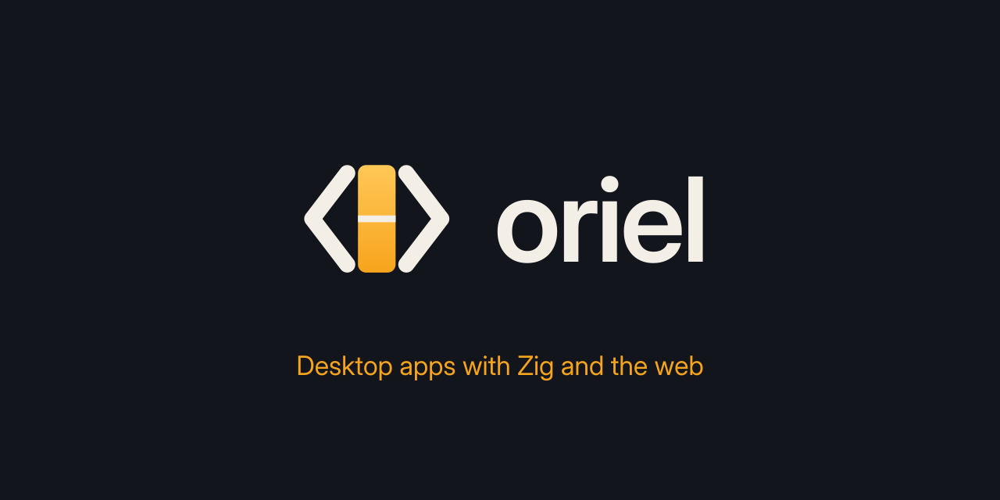
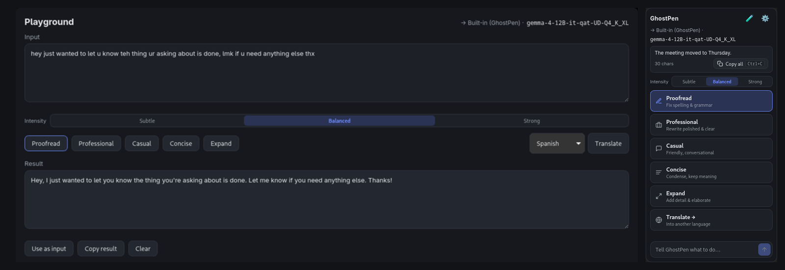
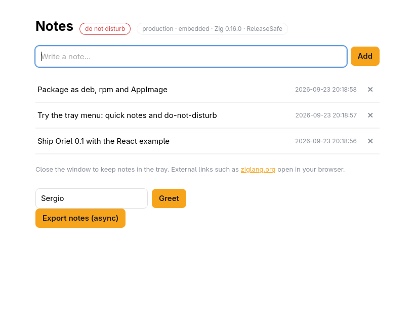
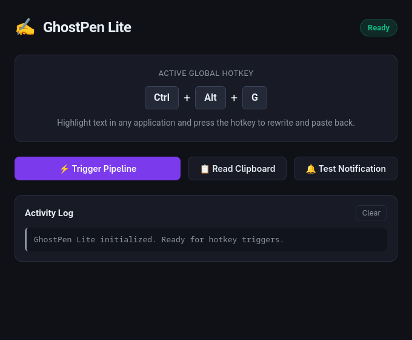
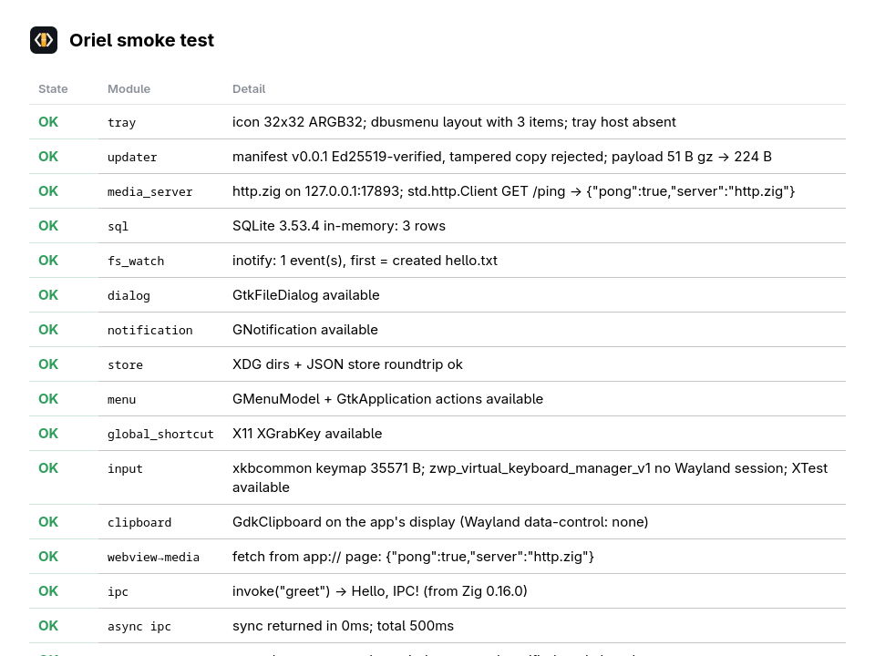

<p align="center"></p>

<p align="center">
  <a href="#license"></a>
  
  
  
</p>

# Oriel

**Desktop apps with Zig and the web.** Oriel is a Tauri-like framework in
Zig 0.16: a native window with the system webview, your frontend (React, Vite,
plain HTML…) embedded in a small binary, and typed JS ↔ Zig calls generated
from plain Zig structs. Linux (GTK4 + WebKitGTK 6.0) first.

- **Small:** a release app is a few MB; the build cache is hundreds of MB, not gigabytes.
- **Typed both ways:** `invoke` and `listen` in TypeScript are generated from your Zig `Commands` and `Events`.
- **Secure by default:** navigation limits, per-origin command capabilities, a strict CSP.
- **Batteries included, opt-in:** tray, updater, SQLite & sqlite-vec, llama.cpp & whisper.cpp, file watching, dialogs, notifications, global shortcuts, clipboard, packaging (deb, rpm, AppImage).

```sh
curl -fsSL https://raw.githubusercontent.com/highercomve/Oriel/main/install.sh | sh     # Linux, macOS
# Windows (PowerShell): irm https://raw.githubusercontent.com/highercomve/Oriel/main/install.ps1 | iex
oriel doctor              # checks Zig 0.16, the platform webview SDK, Node.js
oriel init my-app         # React + Vite (or --template vue|svelte|vanilla)
cd my-app && oriel dev    # hot reload; `oriel build` for the release binary
```

> **Status:** experimental; APIs will change. Linux: complete. Windows: every module, verified on Windows 11 (native and cross-compiled builds). macOS: the shell and every module work (verified on macOS 15, Apple Silicon), incl. Metal for whisper/llama, `.app`/`.dmg` packaging and deep links.
> See [PLAN.md](PLAN.md) for the roadmap, [IDEA.md](IDEA.md) for the background
> and [LIBRARIES.md](LIBRARIES.md) for the dependencies.

## Why "Oriel"?

An **oriel** is a bay window: a small window that juts out from a wall so you
can look outside. That is what the framework is: a native window, set into
the operating system, with the web platform showing through it.

The logo is that window seen from above. Its angled side walls read as `<`
and `>`, like code, around a lit amber pane, a nod to Zig's orange. The
project started as "ziguri"; it became Oriel before its first release.

## Built with Oriel

**[GhostPen](https://github.com/highercomve/GhostPen)** ([website](https://highercomve.github.io/GhostPen/)):
AI text editing anywhere on the desktop. Select text in any app, press a
hotkey, pick an action; the result is pasted back. It runs AI models itself
(llama.cpp compiled in, on the GPU with Vulkan or CUDA on Linux and Metal
on macOS), captions what the computer plays and
takes dictation (whisper.cpp), on Linux, Windows and macOS. Ported from
Tauri; its README [compares the two](https://github.com/highercomve/GhostPen#compared-with-the-rust-tauri-ghostpen)
(build time, binary size, dependencies, memory).



## Examples

Each example is its own Zig package in [`examples/`](examples), built on Oriel
like any app would be.

<table>
  <tr>
    <td width="55%"></td>
    <td width="45%"></td>
  </tr>
  <tr>
    <td><b><a href="examples/react">React notes</a></b>: React + Vite frontend, notes in SQLite on the Zig side, tray menu, typed events, async commands, <code>oriel dev</code> with hot reload, and deb/rpm/AppImage packages.</td>
    <td><b><a href="examples/ghostpen-lite">GhostPen Lite</a></b>: global hotkey → read clipboard → rewrite → paste back, with notifications and an activity log.</td>
  </tr>
  <tr>
    <td colspan="2"></td>
  </tr>
  <tr>
    <td colspan="2"><b><a href="examples/smoke">Smoke test</a></b>: runs every module's check and the security checks (CSP, navigation, IPC) inside the real webview.</td>
  </tr>
</table>

## The `oriel` CLI

A single binary for Linux (static), macOS and Windows (x86_64 and aarch64;
no GTK needed to run it) that scaffolds apps and wraps their build steps,
like `create-tauri-app` and `tauri dev/build`.

```sh
# Linux and macOS: install to ~/.local/bin (or $ORIEL_INSTALL_DIR); pin with ORIEL_VERSION=v0.6.5.
curl -fsSL https://raw.githubusercontent.com/highercomve/Oriel/main/install.sh | sh
```

```powershell
# Windows (PowerShell): installs to %LOCALAPPDATA%\Programs\oriel (or $env:ORIEL_INSTALL_DIR), no admin rights.
irm https://raw.githubusercontent.com/highercomve/Oriel/main/install.ps1 | iex
```

The CLI brings its own Zig when needed: it uses the project's Zig version
(`build.zig.zon` `.minimum_zig_version`) from `$ORIEL_ZIG`, else `zig` on PATH
when that is the right version, else `~/.oriel/zig/<version>`, which it
downloads (minisign-verified) on first use. See [Zig versions](#zig-versions-oriel-zig).

| Command | What it does |
|---|---|
| `oriel init <name>` | New app in `./<name>`: `build.zig`, `build.zig.zon`, `src/main.zig` with sample `Commands`/`Events`, the frontend, and README. Adds Oriel, fetches dependencies and runs `npm install`, so the first build works offline |
| `oriel doctor` | Checks requirements for building and running Oriel apps (`--fix` installs non-admin tools and prints exact system commands) |
| `oriel setup [tool]` | Installs managed tools into `~/.oriel/<tool>` without admin rights (`node`, `nsis`, `webview2`, `zig`, `all`) |
| `oriel dev` | Runs the frontend dev server (Vite) and rebuilds + restarts the app when a `.zig` file changes (hot reload; inotify on Linux, polling on macOS and Windows) |
| `oriel build` | Builds the production app (frontend embedded) into `zig-out/bin/` (`ReleaseSafe` by default) |
| `oriel run` | Builds and runs the production app |
| `oriel package` | Builds distribution packages into `zig-out/package/` (deb, rpm, AppImage on Linux; NSIS `setup.exe` on Windows; `.app` and `.dmg` on macOS) |
| `oriel types` | Regenerates the frontend's TypeScript types (`frontend/src/oriel.ts`) from the Zig `Commands` |
| `oriel check` | Type-check the app's Zig code without building binaries (~1 s) |
| `oriel webview2` | Downloads, verifies (SHA-512 against NuGet registration catalog), and caches Microsoft Edge `WebView2Loader.dll` for Windows (`--version <ver>`, `--arch x64|arm64|all`, `--out <dir>`) |
| `oriel deep-link` | Configure and register custom URL schemes (`add <scheme>`, `register`, `unregister`) |
| `oriel desktop-entry` | Linux: installs the app's `.desktop` file and icons for the build in `zig-out` (global hotkeys need it on Wayland); `--release`, `--remove` |
| `oriel zig` | Manages the Zig versions the CLI uses in `~/.oriel/zig` (`install [version]`, `uninstall <version>`, `list`, `which`) |
| `oriel update` | Updates the CLI binary in place using Oriel's self-updater (`--check`, `--version <tag>`, `--yes`) |
| `oriel --version` | CLI version and the Oriel ref `init` pins |

Every command that acts on an app (`dev`, `build`, `run`, `package`, `types`, `check`)
works from anywhere inside the project, found by walking up to `build.zig.zon`.
Extra arguments are passed through to the underlying build step, e.g.
`oriel build -Doptimize=ReleaseFast`, `oriel package -Dtarget=x86_64-windows` (which automatically supplies the cached `WebView2Loader.dll`),
`oriel run -- --flag`.

### Managed tools and setup (`oriel setup`, `oriel doctor --fix`)

Oriel can download and install developer dependencies without requiring administrator or root rights:

```sh
oriel doctor --fix          # install missing non-admin tools, print exact system commands for the rest
oriel setup all             # install all managed tools required for this OS
oriel setup node [version]  # download and install official Node.js LTS into ~/.oriel/node/<version>
oriel setup nsis            # Windows hosts: download official portable NSIS into ~/.oriel/nsis/3.12
oriel setup webview2        # download and cache Microsoft WebView2Loader.dll
oriel setup zig [version]   # alias to `oriel zig install`
```

When building, developing, or packaging (`oriel build`, `oriel dev`, `oriel run`, `oriel package`), the CLI automatically detects and uses tools installed in `~/.oriel/` (or `$ORIEL_HOME`) if they are missing from system `PATH`:
- If `node` / `npm` are missing from `PATH`, `~/.oriel/node/<v>/bin` (or directory on Windows) is prepended to `PATH` for build subprocesses.
- If `makensis` is missing from `PATH` when packaging for Windows, `~/.oriel/nsis/<v>/makensis.exe` is located and passed automatically.

| Variable | Effect |
|---|---|
| `ORIEL_HOME` | Where Oriel keeps its data instead of `~/.oriel` (tools go in `$ORIEL_HOME/<tool>`) |
| `ORIEL_MAKENSIS` | Override path to `makensis` executable |
| `ORIEL_NSIS_PLATFORM` | Override host OS check for NSIS (e.g. `windows` for testing) |
| `ORIEL_NODE_PLATFORM` | Override host OS check for Node.js download |

### Zig versions (`oriel zig`)

Every command that runs Zig (`dev`, `build`, `run`, `package`, `types`,
`check`, `init`) picks the project's Zig, the `.minimum_zig_version` in
`build.zig.zon` (a matching Zig has the same major.minor and is not older):

1. `$ORIEL_ZIG`, if set (it must be a matching version).
2. `zig` on PATH, if it matches (a different version is skipped).
3. `~/.oriel/zig/<version>/zig` (Windows: `%USERPROFILE%\.oriel\zig\<version>\zig.exe`).
4. Otherwise that version is installed there on first use.

```sh
oriel zig which              # the zig this project uses, and where it comes from
oriel zig install            # the project's version (or: oriel zig install 0.16.0)
oriel zig list               # installed versions, and the zig on PATH
oriel zig uninstall 0.16.0
```

Downloads follow Zig's [community mirror guidance](https://ziglang.org/download/community-mirrors/): the
tarball and its `.minisig` come from the mirrors in random order, with
ziglang.org as the last fallback, and a slow or stalled mirror is skipped. A
tarball is used only if its minisign signature verifies against the Zig
Software Foundation's key (from ziglang.org/download), including the trusted
comment, whose `file:` name must be the requested tarball. It is extracted
with path checks (no absolute paths, `..`, drive letters or symlinks) and moved
into place atomically under a lock file, so concurrent installs don't clash.

| Variable | Effect |
|---|---|
| `ORIEL_ZIG` | Use this Zig binary (must be the project's version) |
| `ORIEL_NO_ZIG_INSTALL=1` | Never download Zig: fail with a hint instead |
| `ORIEL_ZIG_MIRRORS` | Use these mirrors (whitespace- or comma-separated https URLs) instead of the community list, e.g. a company mirror; still verified, ziglang.org stays the fallback |

### `oriel init` options

- `--template react|vue|svelte|vanilla`: React (default), Vue and Svelte are
  Vite projects with typed `invoke`/`listen`; vanilla is a static page with
  no build step and no Node.js.
- `--id com.example.App`: the application id (default `com.example.<Name>`).
- `--oriel-ref <tag|commit>`: the Oriel version to depend on (default: the
  one the CLI was built for).
- `--oriel-path <dir>`: depend on a local Oriel checkout (`.path`), for
  developing against a local copy of Oriel.
- `--no-install`: only record the dependency; skip fetching dependencies and
  `npm install`.
- `--no-webview2`: skip downloading `WebView2Loader.dll` for Windows builds.
- `--yes`: skip confirmation prompt when installing missing Node.js for Vite templates.

### Updating the CLI

`oriel update` updates the running binary in place using Oriel's built-in self-updater engine:

```sh
oriel update --check          # Check whether a newer version is available without installing
oriel update                  # Update to the latest release (prompts for confirmation on a TTY)
oriel update --yes            # Update without prompting (required in non-interactive/CI environments)
oriel update --version v0.6.5 # Update or downgrade to a specific release tag
```

The CLI checks GitHub Releases (`highercomve/Oriel`), downloads the release's `latest.json` (one signed entry per platform; releases before v0.3.1 only have `oriel-update-<arch>-<os>.json`, used as a fallback), verifies the Ed25519 signature of the entry for its own platform against the embedded release key, verifies the payload SHA-256 hash, and atomically replaces the running binary (on Windows, where a running exe can't be overwritten, it is renamed to `oriel.exe.old` first and removed on the next run). The manifest endpoint can be overridden for testing via `ORIEL_RELEASES_URL`.

### Permission commands

`oriel permission add <kind> ["reason"]`, `remove <kind>` and `list` edit
`.permissions` in the app's `build.zig` (see [OS permissions](#os-permissions-orielpermissions)).

### Signing commands

`oriel signing create`, `import <file.p12>` and `show` make and install a
self-signed macOS code-signing certificate, so an app without a Developer ID
keeps its permission grants across updates (see
[macOS packaging](#without-a-developer-id-a-self-signed-certificate) below).

### Deep link commands

`oriel deep-link` configures and registers custom URL schemes for local development:

```sh
oriel deep-link add <scheme>   # Enables .deep_link = true and adds scheme to package url_schemes in build.zig
oriel deep-link register       # Registers the built binary with the OS for development testing
oriel deep-link unregister     # Removes the development registration
```

- **Linux:** `register` creates `$XDG_DATA_HOME/applications/<app_id>.desktop` pointing to the built binary with `%u` and associates it via `xdg-mime default`.
- **Windows:** `register` writes `HKCU\Software\Classes\<scheme>` pointing to the built binary.
- **macOS:** `register` registers the `zig-out/<Name>.app` bundle that `oriel build` writes (its Info.plist declares the schemes) with Launch Services (`lsregister -f`); `unregister` runs `lsregister -u`.

## Building an app

An app is a normal Zig package that depends on Oriel through the Zig package
manager and calls `addApp` (see `examples/react`); `oriel init` sets this
up.

```zig
// build.zig
const std = @import("std");
const oriel = @import("oriel");
pub fn build(b: *std.Build) void {
    const dep = b.dependency("oriel", .{ .target = target, .optimize = optimize, .tray = false });
    _ = oriel.addApp(b, dep, .{
        .name = "my-app",
        .root_source_file = b.path("src/main.zig"),
        .frontend = .{ .dir = "frontend" }, // Vite defaults
    });
}
```

That provides the app developer workflow:

| Command | What it does |
|---|---|
| `oriel dev` | Starts Vite and opens the app on `http://localhost:5173` with hot reload; closing the window, Ctrl-C or a signal stops Vite and the app too |
| `oriel build` | `npm install` (if needed) → generate types → `npm run build` → embed `dist/` → compile production binary into `zig-out/bin/` |
| `oriel run` | Runs the production build |
| `oriel package` | Builds distribution packages into `zig-out/package/` (deb, rpm, AppImage on Linux; NSIS `setup.exe` on Windows) |
| `oriel types` | Regenerates `frontend/src/oriel.ts` from the Zig `Commands` |
| `oriel check` | Type-checks the app's Zig code without building binaries |

Every module and plugin is on by default. Pass `.<name> = false` to
`b.dependency("oriel", ...)` to leave one out: it is then neither compiled
nor linked.

### App icon

Oriel derives all platform icons from a single source PNG (1024×1024 recommended):

```zig
_ = oriel.addApp(b, dep, .{
    .name = "my-app",
    .root_source_file = b.path("src/main.zig"),
    .icon = b.path("icon.png"), // optional, defaults to Oriel brand icon
    ...
});
```

The embedded PNG bytes are accessible in `src/main.zig` via `app.icon_bytes` (`const app = @import("oriel_app");`) and passed to `oriel.main(..., .{ .icon = app.icon_bytes, ... })`.

At build time:
- **Windows**: The PNG is converted into a multi-resolution `.ico` (16, 24, 32, 48, 64, 256) and embedded directly into the executable via a Win32 resource (`RT_GROUP_ICON`). Windows Explorer, the taskbar, window title bar, Alt-Tab, Start-menu shortcuts, and the NSIS installer/uninstaller (`DisplayIcon`) use it automatically.
- **Linux**: Distribution packages (`.deb`, `.rpm`, `.AppImage`) install the icon into the hicolor icon theme (`/usr/share/icons/hicolor/<size>x<size>/apps/<id>.png`). The window icon name is set to the application ID. For unpackaged dev runs, `zig build desktop-entry` installs the icon into `$XDG_DATA_HOME/icons/hicolor/`.
- **macOS**: Converted into an Apple Icon Image (`icon.icns`) for `.app` bundles, and set dynamically on the Dock via `NSApp setApplicationIconImage:` for unbundled dev runs.

> **Using Oriel without the CLI**:
> To add Oriel to an existing Zig project manually, add the dependency with:
> ```sh
> zig fetch --save git+https://github.com/highercomve/Oriel
> ```
> This records Oriel's URL and hash in your `build.zig.zon`; `zig build` downloads it and its dependencies into Zig's global cache. Call `oriel.addApp()` in your `build.zig`. The build steps (`build`, `run`, `dev`, `package`, `types`, `check`) can then be invoked directly with `zig build <step>`.

## Commands and events

```zig
// src/main.zig
pub const Commands = struct {
    pub fn greet(gpa: std.mem.Allocator, args: struct { name: []const u8 }) ![]const u8 {
        return std.fmt.allocPrint(gpa, "Hello, {s}!", .{args.name});
    }
};

/// Pushed from Zig to the page.
pub const Events = struct { notes_changed: []const Note };
const events = oriel.App.events(Events);
// anywhere, any thread: events.emit(.notes_changed, notes);  (type-checked)

pub fn main(init: std.process.Init) !u8 {
    const app = @import("oriel_app"); // build-time: embedded assets / dev settings
    return oriel.main(init, .{ .commands = Commands, .events = Events }, .{
        .id = "com.example.App",
        .title = "App",
        .assets = app.assets,
        .dev = app.dev,
        .setup = setup,     // runs once the window exists: create the tray, …
        .on_close = .hide,  // keep running in the tray
    });
}
```

Apps that parse their own arguments can call
`oriel.App.run(init.io, api, config)` directly instead of `oriel.main`;
the `std.Io` is passed in explicitly (there is no global to set).

```ts
// frontend: generated from the Zig structs (oriel types)
import { invoke, listen, openExternal } from "./oriel";
const msg = await invoke("greet", { name: "Ada" });   // msg: string
const off = listen("notes_changed", (notes) => …);    // notes: Note[]
await openExternal("https://ziglang.org");            // opens in default browser
```

Command errors reject the promise with the Zig error name.

### Error messages (`oriel.ipc.fail`)

A command that returns an error rejects the page's `invoke()` promise with the
error's name (`"EmptyName"`). To give the page a readable message instead:

```zig
pub fn fetch_models(_: std.mem.Allocator, args: struct { baseUrl: []const u8 }) ![]const []const u8 {
    return listModels(args.baseUrl) catch |err|
        oriel.ipc.fail("Could not reach {s} ({s})", .{ args.baseUrl, @errorName(err) });
}
```

### System browser (`openExternal`)

To open links in the user's default browser instead of navigating the webview, use `openExternal(url)` (available as an export from `./oriel` and on `window.oriel.openExternal(url)`):
- On Linux, opens via the XDG desktop portal / `xdg-open`; on Windows, opens via `ShellExecuteW`; on macOS, via `NSWorkspace openURL:`.
- Only `http:`, `https:` and `mailto:` schemes are allowed by default (configurable in `Security.open_external_schemes`).
- Dangerous schemes (`file:`, `javascript:`, `data:`, `blob:`, `about:`) and control characters are always rejected.
- Gated by the capability model: remote origins must be granted the `open_external` command capability to call it.

### Async commands

By default, commands run on the GTK main thread. To avoid freezing the UI during slow operations (I/O, database queries, network requests), declare `pub const async_commands = .{ "cmd1", ... };` in `Commands`. Async commands run on a worker thread pool, receive `std.Io` if requested, and their reply is returned on the main thread without blocking the UI. Each async invocation gets its own arena allocator, freed after the reply is sent. (Cancellation is currently out of scope).

Blocking work started outside a command (a hotkey or tray callback, which run on the main
thread) goes to the same pool with `try oriel.App.spawn(func, .{args...})`; an error it
returns is logged. `App.quit` and `App.emit` are safe from any thread.

```zig
pub const Commands = struct {
    pub const async_commands = .{ "export_notes" };

    pub fn export_notes(gpa: std.mem.Allocator, io: std.Io) ![]const u8 {
        // Runs on worker thread pool; UI remains unblocked
        ...
    }
};
```

### Windows from JavaScript (`oriel.window`)

JavaScript running in the webview can manage windows and open child windows via `oriel.window` (also exported from `frontend/src/oriel.ts`):

```ts
import { window } from "./oriel";

// Open a new child window
const child = await window.open({
  label: "child-win",
  url: "index.html?child=1",
  title: "Child Window",
  width: 600,
  height: 400,
  resizable: true,
});

// Window handle methods
await child.setTitle("New Title");
await child.setSize(800, 600);
await child.maximize();
await child.focus();
await child.emit("custom_event", { data: 123 });
await child.close();

// Query windows
const currentWin = window.current(); // WindowHandle for current window
const allWins = await window.all();  // WindowHandle[]
const win = await window.get("child-win");

// Targeted events
await window.emitTo("child-win", "ping", { data: 42 });

// Lifecycle events
import { listen } from "./oriel";
listen("window:created", (p) => console.log("Window created:", p.label));
listen("window:closed", (p) => console.log("Window closed:", p.label));
```

#### Window Security & Policy

Window creation and control are governed by `Config.security.window_api`:
- **Opt-in:** enabled by default for app-local origins (`app://app` and dev server). Remote origins are blocked by default unless granted by capability (`.window_api = true`) or `.allow_remote = true`.
- **URL validation:** only app-local URLs are allowed by default (`allow_remote_urls = false`). Dangerous schemes (`javascript:`, `file:`, `data:`) are rejected.
- **Label validation:** labels must be 1–64 characters containing only alphanumeric characters, underscores (`_`), and dashes (`-`).
- **Window modification:** windows can only modify and close themselves by default (`allow_modify_other_windows = false`).
- **Max window cap:** defaults to a maximum of 16 concurrent windows (`max_windows = 16`).

#### Config `window_open`

Configure the behavior of `window.open()` and links with `target="_blank"` navigating to allowed app-local URLs:

```zig
.window_open = .new_window, // .main_view (default: load in main view) or .new_window (open a new Oriel window)
```

## Security

Modeled on Tauri. Configure it with `Config.security`:

```zig
.security = .{
    .csp = oriel.security.default_csp,               // null disables it
    .allowed_origins = &.{"https://docs.example.com"}, // may be shown, no IPC
    .capabilities = &.{                                // remote origins with IPC
        .{ .origin = "https://*.example.com", .commands = &.{"greet", "open_external"} },
    },
    .external_links = .open_in_browser,                // or .deny
    .open_external_schemes = &.{ "http", "https", "mailto" }, // allowed schemes for openExternal
},
```

- **Navigation:** the webview only shows `app://app` (plus the dev server in
  dev builds) and the origins listed above. Everything else is blocked,
  including iframes, redirects and popups. Links the user clicks to other
  http(s)/mailto/tel URLs open in the default app.
- **IPC scope:** the app's own pages may call every command. Remote origins
  may call only what a capability grants. Each call is checked against the
  exact origin of the page currently shown.
- **Bridge:** `window.oriel` is injected only on pages allowed to use IPC.
- **CSP:** every `app://` response carries a strict Content-Security-Policy
  (no inline scripts, no `eval`) plus `X-Content-Type-Options: nosniff`.
  Dev builds serve pages from the dev server, which sets no CSP.
- **WebView settings:** scripts can't open windows; no `file://`
  cross-access; devtools only in Debug builds.

- **Hardening (opt-in):** `security.freeze_prototype = true` freezes
  `Object.prototype` before any page script runs (prototype pollution; code
  that assigns `Foo.prototype.toString = …` then throws in strict mode), and
  `security.headers` adds response headers to `app://` pages and media from
  an allowlist (COOP, COEP, CORP, Permissions-Policy, Access-Control-*, …).
  Mind the trade-offs: COOP `same-origin` breaks opener popups (OAuth), and
  COEP `require-corp` blocks cross-origin frames and subresources that don't
  opt in.

- **Inline code by hash:** the build hashes every inline `<script>` and
  `<style>` block of each HTML file (SHA-256) and adds the hashes to that
  page's CSP, so the app's own inline code runs without `'unsafe-inline'`
  while injected code doesn't. `security.strict_styles = true` also drops
  `'unsafe-inline'` from `style-src` (the app's `<style>` blocks keep working;
  `style="..."` attributes in the HTML and injected styles don't). A directive
  that still has `'unsafe-inline'` is left alone, since a hash would switch it
  off.

- **Isolation pattern (opt-in):** `.isolation = .{ .hook = b.path("isolation/hook.js") }`
  in `addApp`, and `.security = .{ .isolation = app.isolation }` in the
  config. Every call from the app's own pages (`app://` and the dev server),
  built-ins included, is first passed to the hook, which runs in a sandboxed
  frame the page can't reach and returns the call (or a modified one) or
  throws to reject it. The frame signs approved calls (HMAC-SHA256 with a key
  minted per frame load, never visible to the page, one-time sequence
  numbers), and Zig refuses anything unsigned or replayed. An XSS or a
  compromised dependency can then only call Zig through the hook. Remote
  capability origins are not covered: they keep the IPC token and their
  capabilities. Events from Zig to the page are unchanged. The hook is
  inlined into the frame's page, so it can't contain `</script` or `<!--`,
  and it has no network access. A custom `csp` must allow the isolation
  frame (`frame-src oriel.isolation.origin`; Oriel adds it to the default).

`examples/smoke` runs these checks inside the real webview (`--auto-quit`;
`-Disolation=false` builds it without the isolation hook).

### OS permissions (`oriel.permissions`)

Declare what the app needs once; Oriel writes it into the packages (macOS
`Info.plist` usage texts and entitlements), lets you check and request it, and
denies anything undeclared, including the webview's `getUserMedia`,
geolocation and notification requests:

```sh
oriel permission add microphone "Dictation turns your speech into text"
oriel permission add accessibility          # default reason text
oriel permission list
```

```zig
// build.zig (what `oriel permission add` writes)
.permissions = .{ .microphone = "Dictation turns your speech into text", .accessibility = "" },
// main.zig
.permissions = app.permissions,
```

```ts
import { permissions } from "./oriel";
if ((await permissions.request("microphone")) === "denied") await permissions.openSettings("microphone");
```

Kinds: `microphone`, `camera`, `screen_capture`, `accessibility`, `location`,
`notifications`, `system_audio`. Statuses: `granted`, `denied`, `prompt`,
`unknown`. See the [Permissions guide](https://highercomve.github.io/Oriel/docs/permissions/).

## Tray

```zig
fn setup() !void {
    tray = try oriel.tray.Tray.create(gpa, .{
        .id = "com.example.App",
        .title = "My App",
        .icon = .{ .png = @embedFile("icon.png") }, // or .{ .name = "theme-icon" }
        .menu = &.{
            .{ .item = .{ .id = "show", .label = "Show" } },
            .{ .check = .{ .id = "dnd", .label = "Do not disturb" } },
            .separator,
            .{ .submenu = .{ .label = "Help", .items = &.{ .{ .item = .{ .id = "about", .label = "About" } } } } },
            .{ .item = .{ .id = "quit", .label = "Quit" } },
        },
        .on_menu = onMenu, // fn (id: []const u8, checked: ?bool) void
    });
}
```

Linux uses StatusNotifierItem + DBusMenu over D-Bus, and works with KDE,
GNOME (AppIndicator extension), waybar, Quickshell and other hosts. macOS
uses an `NSStatusItem` in the menu bar (right-click or Control-click opens
the menu; the PNG is shown at 18 pt).
Left-clicking the icon toggles the window. `setMenu`, `setChecked`,
`setTooltip`, `setTitle` and `setIcon` update the tray at runtime. If the
tray host restarts, the icon registers again.

## Window and lifecycle

`oriel.App.showWindow()`, `hideWindow()`, `toggleWindow()`, `quit(code)` and
`openExternal(url)`. `on_close = .hide` keeps the app running when the window
is closed. Apps are single-instance: launching again brings the window back.
SIGINT and SIGTERM shut down cleanly. The dev server stops with the app, even
when the app is killed. Under `oriel dev`, stopping the process (Ctrl-C,
SIGTERM or SIGKILL, e.g. from a script) also stops everything: `dev_runner`
watches the process through a pidfd, `dev_runner` and the app get
`PR_SET_PDEATHSIG`, and `dev_runner` starts Vite and the app in their own
process groups and kills each whole group (SIGTERM, then SIGKILL after 0.5 s)
on exit.

### Routes and Single-Page Apps (SPA)

`WindowOptions.url` supports relative route paths such as `"/settings"`:
- In **development** (`config.dev`), the route resolves to the local dev server (e.g. `http://localhost:5173/settings`).
- In **production**, it resolves to the local embedded asset origin (`app://app/settings` on Linux and macOS, `https://app.localhost/settings` on Windows).
- Absolute URLs with schemes are checked against `allowed_origins` and `capabilities`, and dangerous schemes (`file:`, `javascript:`, `data:`, `blob:`, `about:`) are rejected.

**SPA Fallback caveat**:
With `config.spa_fallback = true` (default), deep links reload and serve `index.html` for client-side routers (such as React Router's `BrowserRouter`). However, paths whose last segment contains a dot (e.g. `/u/john.doe` or `/report.pdf`) are treated as asset files rather than routes and will return 404 if not found in embedded assets.

## Plugins and system modules

### Global shortcuts (`oriel.global_shortcut`)

Registers global system-wide key combinations that trigger callbacks even when the application is unfocused or minimized:

```zig
try oriel.global_shortcut.register(gpa, .{
    .id = "rewrite_hotkey",
    .description = "GhostPen text rewrite hotkey",
    .trigger = "CTRL+ALT+G",
}, &onHotkey);
```

- **Wayland:** `org.freedesktop.portal.GlobalShortcuts`: the plugin registers the app id
  with the portal (`org.freedesktop.host.portal.Registry`), creates a session, binds the
  shortcuts (`BindShortcuts`, with `description` and `preferred_trigger`; the compositor may
  ask the user to confirm or pick other keys) and dispatches the session's `Activated`
  signals. Call `register` on the main thread (e.g. in `setup`); bind failures are logged.
  **The app id (`Config.id`) needs an installed `<id>.desktop` file**
  (e.g. `~/.local/share/applications/com.example.App.desktop`): xdg-desktop-portal refuses
  GlobalShortcuts to host apps without one. There is no X11 fallback on Wayland (XGrabKey only
  fires while an XWayland window has focus); without the portal `register` returns
  `error.PortalUnavailable`.
- **X11:** Uses `XGrabKey` with a GLib main loop watch on the X connection file descriptor.
- **Windows:** Uses Win32 `RegisterHotKey` / `WM_HOTKEY` routed through the hidden host window. Unregisters on `unregister` and `deinit`. Same trigger string syntax ("CTRL+ALT+G", etc.). Marshalling via `Shell.runOnMainThread`. Runtime untested on Windows.
- **macOS:** Carbon `RegisterEventHotKey` (no permission needed); callbacks on the main thread. Modifiers map literally: `ctrl` = Control, `alt` = Option, `shift`, `super`/`cmd`/`meta`/`win` = Command. Registration fails with `error.HotkeyAlreadyRegistered` when another app holds the combination.

### Input injection (`oriel.input`)

Simulates keyboard input and clipboard shortcuts:

```zig
try oriel.input.typeText("Hello from Zig!");
try oriel.input.keyCombo("ctrl+v");
try oriel.input.copy();
try oriel.input.paste();
```

- **Wayland:** Uses `zwp_virtual_keyboard_v1` with memfd XKB keymap upload.
- **X11:** Uses XTest extension (`XTestFakeKeyEvent`).
- **Windows:** Uses Win32 `SendInput` (UTF-16 Unicode pairs for text, virtual key combos for shortcuts). Extended keys set `KEYEVENTF_EXTENDEDKEY`. Runtime untested on Windows.
- **macOS:** `CGEvent` keyboard events (text as Unicode strings, layout independent); `copy`/`paste` send ⌘C/⌘V. Needs the **Accessibility** permission (System Settings → Privacy & Security → Accessibility; for an unbundled binary, the app that started it): without it every call returns `error.AccessibilityNotGranted` instead of posting events macOS would drop.

### Clipboard (`oriel.clipboard`)

Background and focused clipboard read/write for text and PNG images. Reads may wait
for another app (or for our own main loop, when we own the selection), so the blocking
reads belong on a worker thread and the main thread gets a callback API:

```zig
// Worker thread: an async command, or App.spawn from a hotkey/tray callback.
const text = try oriel.clipboard.readText(gpa);   // readImage -> ?PNG bytes
try oriel.clipboard.writeText("New content");      // any thread; writeImage(png)

// Main thread: never blocks, callback runs on the main thread.
oriel.clipboard.readTextAsync(onText, null);        // readImageAsync
```

- `readText`/`readImage` on the main thread return `error.WouldBlockMainThread` on Linux.
- **Wayland:** background reads (no window focus needed) via `ext_data_control_v1` on a
  private Wayland connection. Writes go through `GdkClipboard`.
- **X11 / no data-control:** `GdkClipboard`; worker reads are handed to the main loop.
- **Windows:** Uses Win32 `OpenClipboard` with retry loop. Text uses `CF_UNICODETEXT`. Images use registered `PNG` format (with IEND trimming) and standard `CF_DIB` (bottom-up DIB via `zigimg`). Worker threads marshal calls to the main thread via `Shell.runOnMainThread`. Async reads use `Shell.dispatchWithCleanup`. Runtime untested on Windows.
- **macOS:** `NSPasteboard` on the main thread (workers marshal there): text, and images written as PNG + TIFF (TIFF converted to PNG on read).
- When this process owns the selection (it offers a per-process marker MIME type), reads
  return the data we last wrote without a round-trip.

### Dialogs (`oriel.dialog`)

File picker dialogs using `GtkFileDialog` on Linux and `IFileOpenDialog` / `IFileSaveDialog` on Windows:

```zig
const file = try oriel.dialog.openFile(gpa, .{
    .title = "Select Document",
    .filters = &.{ .{ .name = "Text Files", .patterns = &.{ "*.txt", "*.md" } } },
});
```

- **Linux:** Uses `GtkFileDialog`.
- **Windows:** Uses COM `IFileOpenDialog` / `IFileSaveDialog` (with `FOS_PICKFOLDERS` for folder pickers, `FOS_ALLOWMULTISELECT` for multiple files) marshaled to the main thread via `Shell.runOnMainThread`. Runtime untested on Windows.
- **macOS:** `NSOpenPanel` / `NSSavePanel`, run modally on the main thread (the save panel confirms overwrites).

### Notifications (`oriel.notification`)

Desktop notifications via GIO `GNotification` (`GApplication.send_notification`) on Linux and `Shell_NotifyIconW` balloon tooltips on Windows:

```zig
try oriel.notification.notify(.{
    .title = "Processing Complete",
    .body = "Your notes have been exported successfully.",
});
```

- **Linux:** Uses GIO `GNotification`.
- **Windows:** Uses `Shell_NotifyIconW` with balloon notifications (`NOTIFYICON_VERSION_4`). Callbacks route via `Shell.WM_NOTIFY_CALLBACK` and remove the balloon on dismiss/timeout/shutdown. Runtime untested on Windows.
- **macOS:** `UNUserNotificationCenter` in an `.app` bundle (macOS asks for permission on the first notification). An unbundled executable has no bundle id, which UserNotifications requires, so it falls back to `osascript` ("display notification", shown as Script Editor).

### Multiple windows and window options

Create and manage multiple windows at runtime with targeted or broadcast events:

```zig
const win = try oriel.App.openWindow(.{
    .label = "settings",
    .title = "Settings",
    .url = "settings.html",
    .width = 600,
    .height = 400,
    .min_width = 400,
    .min_height = 300,
    .resizable = true,
    .decorations = true,
    .remember_geometry = true, // saves size/state across app runs
});

// Window controls
win.setTitle("Preferences");
win.setSize(700, 450);
win.emit("refresh", .{}); // targeted to this window
oriel.App.emit("global_event", .{}); // broadcast to all windows

// Retrieve or close by label
if (oriel.App.getWindow("settings")) |w| w.show();
oriel.App.closeWindow("settings");
```

Per-window command scoping is supported via `.windows = &.{"main"}` in `Security.capabilities`.

### App menu bar (`oriel.menu`)

Native application menu bar: `GMenuModel` on Linux, Win32 `HMENU` + `HACCEL` on Windows:

```zig
const menu_items = [_]oriel.menu.MenuItem{
    .{
        .submenu = .{
            .label = "File",
            .items = &.{
                .{ .item = .{ .id = "new", .label = "New Note", .shortcut = "<Control>n" } },
                .{ .separator = {} },
                .{ .item = .{ .id = "quit", .label = "Quit", .shortcut = "<Control>q" } },
            },
        },
    },
};

fn onMenuAction(id: []const u8, checked: ?bool) void {
    if (std.mem.eql(u8, id, "quit")) oriel.App.quit(0);
}

try oriel.App.setMenu(&menu_items, onMenuAction);
```

- **Linux:** Uses GTK4 `GMenuModel` + `GtkApplication` actions.
- **Windows:** Uses Win32 window menus (`CreateMenu`, `AppendMenuW`) and accelerator tables (`CreateAcceleratorTableW`). Commands and hotkeys marshal through `Shell.runOnMainThread`. Runtime untested on Windows.
- **macOS:** the app's menus go into the main menu between the default App menu (Hide, Quit) and the default Edit / Window menus (kept unless the app defines menus with those names). `<Ctrl>` / `<Primary>` shortcuts become ⌘, `<Alt>` ⌥.

### Settings store (`oriel.store`)

Thread-safe JSON settings store with atomic writes, plus standard directory helpers (XDG on Linux, Known Folders Roaming/Local AppData on Windows):

```zig
const config_dir = try oriel.store.configDir(gpa, "dev.oriel.Notes");
const data_dir = try oriel.store.dataDir(gpa, "dev.oriel.Notes");
const cache_dir = try oriel.store.cacheDir(gpa, "dev.oriel.Notes");

var store = try oriel.store.Store.open(gpa, "dev.oriel.Notes", "settings");
defer store.deinit();

try store.set("theme", "dark");
try store.set("zoom", 1.25);
try store.save();

const theme = store.getString("theme");
```

- **Linux:** XDG directory specifications with glib atomic file utilities.
- **Windows:** Win32 Known Folders (`FOLDERID_RoamingAppData`, `FOLDERID_LocalAppData`) with `SRWLOCK` and `CreateFileW` / `FlushFileBuffers` / `MoveFileExW` atomic file replacement. Runtime untested on Windows.
- **macOS:** `~/Library/Application Support/<app_id>` (config and data) and `~/Library/Caches/<app_id>`; temp file (O_EXCL, 0600) + fsync + rename + directory fsync.

### Media server (`oriel.media_server`)

Streams large local video/audio to the webview with HTTP range requests
(RFC 9110 §14), so `<video>` can seek in multi-GB files without loading them.
Two transports share the same Range parser and path checks
(`src/modules/media/range.zig`, `src/modules/media/open.zig`):

```zig
var media: oriel.media_server.Server = undefined; // fixed address until stop()
try media.start(io, gpa, .{
    .root_dir = "/home/me/Videos", // `/<path>` maps to files below it
    .port = 17893,                 // 127.0.0.1 only
    .allowed_origin = "app://app", // Access-Control-Allow-Origin on file routes
    .symlink_policy = .inside_root, // or .refuse_all
});
defer media.stop();
// Optional: the same files at app://app/media/<path> (fetch/XHR/ only)
try oriel.media_server.scheme.setRoot("/home/me/Videos", .inside_root);
```

- **Ranges:** `bytes=a-b`, `bytes=a-`, `bytes=-n` → `206` with `Content-Range`;
  unsatisfiable → `416` with `Content-Range: bytes */size`; a malformed header
  is ignored (`200`, full body); for several ranges only the first is served
  (one `206`, allowed by the RFC). `HEAD` is supported. Files are streamed in
  64 KiB chunks with u64 offsets (files over 4 GiB work).
- **Paths:** percent-decoded; NUL, backslashes, absolute paths and `..`
  segments get `403`. Files are opened with `openat2(RESOLVE_BENEATH)` relative
  to the root's fd, so the kernel refuses anything that resolves outside the
  root at open time (no check-then-open race). Symlinks: `.inside_root`
  (default) follows links that stay inside the root; `.refuse_all` refuses
  every symlink. Missing files and directories get `404`.
- **TCP vs `app://`:** the TCP server works with every client, `<video>`
  included, but any local process can connect to the port and the page needs
  CORS (`media-src` in the default CSP allows `http://127.0.0.1:*`). The
  `app://app/media/` route needs no port and no CORS, and its handler runs on
  the main thread (the file is read by GIO on a worker thread), but WebKitGTK's
  GStreamer media player only accepts http(s)/blob/data/file URLs, so
  `<video src="app://...">` fails with `MEDIA_ERR_SRC_NOT_SUPPORTED`. Use the
  TCP URL for `<video>`/`<audio>`.
- **Windows support:** on Windows, the media root is opened safely beneath the root directory via `CreateFileW` with heap-allocated UTF-16 path conversions, intermediate symlink/reparse point traversal rejection (`GetFinalPathNameByHandleW` lexical path comparison under `SymlinkPolicy.refuse_all`), and non-blocking traversal checks. WebView2 intercepts `https://app.localhost/media/*` requests and serves ranged media streams via a custom read-only COM `IStream` (`FileWindowStream`) over a duplicated handle using `OVERLAPPED` reads (no shared file pointer, no 16 MiB truncation cap, RFC-compliant 200/206 status codes, and checked COM calls). Runtime untested on Windows.
- **macOS support:** files are opened relative to the root's fd and the kernel's path of the opened file (`F_GETPATH`) must lie below the root (macOS 15 accepts `O_RESOLVE_BENEATH` but doesn't enforce it); `refuse_all` adds `O_NOFOLLOW_ANY`. `app://app/media/` streams through the `WKURLSchemeHandler`: a worker reads 256 KiB chunks, one in flight, delivered on the main thread; `<audio>`/`<video>` from the TCP server seek normally.

### Logging (`oriel.log`)

Thread-safe routing of `std.log` to stderr and a log file, once the app sets `pub const std_options: std.Options = .{ .logFn = oriel.log.logFn };` in its `main.zig`:

| OS | Log file |
| --- | --- |
| Linux | `$XDG_DATA_HOME/<app_id>/app.log` (`~/.local/share/<app_id>/app.log`) |
| Windows | `%LOCALAPPDATA%\<app_id>\app.log` |
| macOS | `~/Library/Logs/<app_id>/app.log` (also listed in Console.app) |

The file is appended to and never rotated. On macOS it matters most: an app started from Finder or the Dock has no terminal, so stderr goes nowhere. In debug/dev builds, WebKit console messages are forwarded directly to stdout.

### Updater (`oriel.updater`)

Built-in self-updater featuring Ed25519 signature verification, atomic file replacement, throttled download progress streaming, and in-place restart.

#### 1. Key generation

Generate a new Ed25519 keypair using the app build step registered by `oriel.addApp` (run inside your app project):

```sh
zig build keygen -- --name myapp --out-dir ~/.config/myapp/keys
```

- Private key written to `$XDG_CONFIG_HOME/oriel/keys/<name>.key` (default) with file mode `0600` (refuses to overwrite existing files without `--force`).
- Public key written to `<name>.pub` (standard base64) and printed to stdout.

#### 2. Signing release artifacts

Sign an update artifact (raw binary, AppImage, or `.gz` archive) and produce a manifest JSON using the app build step (run inside your app project):

```sh
zig build sign-update -- zig-out/bin/my-app \
  --app-id com.example.App \
  --version 1.2.0 \
  --url https://releases.example.com/my-app-1.2.0 \
  --key ~/.config/myapp/keys/myapp.key \
  --out manifest.json
```

**Signed manifest format (`oriel-update-v2`):**
```json
{
  "app_id": "com.example.App",
  "version": "1.2.0",
  "target": "x86_64-linux",
  "format": "raw",
  "size": 1048576,
  "sha256": "e3b0c44298fc1c149afbf4c8996fb92427ae41e4649b934ca495991b7852b855",
  "url": "https://releases.example.com/my-app-1.2.0",
  "signature": "base64-encoded-ed25519-signature"
}
```

The signature is computed over domain-separated canonical bytes:
`"oriel-update-v2\n" ++ app_id ++ "\n" ++ version ++ "\n" ++ target ++ "\n" ++ format ++ "\n" ++ size ++ "\n" ++ sha256 ++ "\n" ++ url ++ "\n"` (plus optional `expires\n`).

One file for every platform (like Tauri's `latest.json`): sign each platform's artifact with its `--target`, then combine the manifests:

```sh
zig build combine-manifests -- manifest-*.json --out latest.json
```

`latest.json` has a `platforms` map (`"x86_64-linux"`, `"aarch64-macos"`, `"x86_64-windows"`, ...), each entry a complete signed manifest. Publish it at one stable URL (e.g. `https://github.com/you/app/releases/latest/download/latest.json`) and use that as `manifest_url` in every build: each app picks and verifies the entry for its own target, and an entry filed under the wrong platform is refused. A single-platform manifest still works as `manifest_url`.

#### 3. Embedding public key in the app

Configure `update_public_key` in `build.zig`:

```zig
_ = oriel.addApp(b, dep, .{
    .name = "my-app",
    .root_source_file = b.path("src/main.zig"),
    .frontend = .{ .dir = "frontend" },
    .update_public_key = "base64-public-key-string",
});
```

The public key is exposed at compile time via `@import("oriel_app").update_public_key`.

#### 4. JS IPC and runtime API

In `src/main.zig`, register the comptime-configured updater commands:

```zig
const app = @import("oriel_app");

const Updater = oriel.updater.Commands(.{
    .app_id = "com.example.App",
    .manifest_url = "https://releases.example.com/latest.json",
    .current_version = "1.0.0",
    .public_key_b64 = app.update_public_key orelse @panic("missing update key"),
});

pub const Commands = struct {
    pub const updater_check = Updater.updater_check;
    pub const updater_install = Updater.updater_install;
    pub const updater_restart = Updater.updater_restart;

    pub const async_commands = .{ "updater_check", "updater_install", "updater_restart" };
};
```

For typed `listen` in the generated TypeScript, declare the progress event in your `Events` struct:
`@"updater://progress": struct { downloaded: u64, total: ?u64 }`.

From frontend TypeScript / JavaScript:

```ts
import { invoke, listen } from "./oriel";

// 1. Check for update
const update = await invoke("updater_check");
if (update?.available) {
    console.log(`Update ${update.version} available!`);

    // Listen to download progress events (throttled to ~10/s)
    const unlisten = listen("updater://progress", ({ downloaded, total }) => {
        console.log(`Downloaded ${downloaded} of ${total} bytes`);
    });

    // 2. Download and atomically install update
    await invoke("updater_install");
    unlisten();

    // 3. Restart running application
    await invoke("updater_restart");
}
```

#### 5. AppImage behavior

When running inside an AppImage (`$APPIMAGE` environment variable is set), `oriel.updater` automatically targets the outer AppImage executable for replacement and re-exec, keeping desktop launcher integrations seamless.

#### 6. Windows behavior

On Windows, running executables cannot be directly overwritten. `oriel.updater` downloads and verifies payloads next to the executable as `<exe>.new`, renames the running binary to `<exe>.old` using `MoveFileExW` (`MOVEFILE_REPLACE_EXISTING`), and promotes `<exe>.new` to `<exe>` (with automatic rollback on failure). Stale `.old` files are cleaned up on subsequent startup (`updater.init`). Application restart is performed via `CreateProcessW` using the original command line (`GetCommandLineW`). Runtime untested on Windows.

#### 7. macOS behavior

A plain executable is replaced like on Linux (`raw` / `raw.gz`). An app in a
`.app` bundle is updated as a whole with the format `app.tar.gz` (a gzip'd tar
of one `<Name>.app`; build it with `COPYFILE_DISABLE=1 tar -czf ... Name.app`):
it is unpacked next to the running bundle, swapped with it atomically
(`renameatx_np` `RENAME_SWAP`) and the old bundle is deleted; `restart`
relaunches the bundle with `open -n`. Other OSes refuse `app.tar.gz`. For
distribution, tar the signed and notarized `zig-out/package/<Name>.app` (see
[macOS bundles](#macos-bundles-app-dmg)), not `oriel build`'s ad-hoc
`zig-out/<Name>.app`.

#### 8. Security notes

- **JS cannot choose URLs, keys, or paths**: The manifest URL, public key, and target path are configured strictly in native Zig code; frontend code cannot redirect downloads or bypass signature verification.
- **Private keys**: Never commit private keys to version control or bundle them into client applications. Use `keygen` with secure out-of-repo storage (`mode 0600`).
- **Transport**: Production manifest and payload URLs should always use HTTPS.

### SQLite and vector search (`oriel.sql`, `oriel.sqlite_vec`)

Oriel provides embedded SQLite database support and opt-in vector search via the `sqlite-vec` extension (`vec0` virtual tables).

#### Enabling sqlite-vec

- **Command-line flag:** `oriel build -Dsqlite_vec` (requires `sql`, which defaults to enabled).
- **In an app's `build.zig`:** pass `.sqlite_vec = true` in `b.dependency("oriel", ...)`:
  ```zig
  const oriel_dep = b.dependency("oriel", .{
      .target = target,
      .optimize = optimize,
      .sqlite_vec = true,
  });
  ```
- **Build time:** Amalgamation C compilation adds negligible overhead (~1–2 seconds cold).
- **License:** Dual-licensed MIT OR Apache-2.0.

#### Usage

When `sqlite_vec` is enabled, the extension is registered automatically into every database connection opened with `oriel.sql.Db.open`:

```zig
const oriel = @import("oriel");

// Open SQLite in-memory or on disk
const db = try oriel.sql.Db.open("data.db");
defer db.close();

// Create a vector table with 4-dimensional embeddings
try db.exec("CREATE VIRTUAL TABLE items USING vec0(embedding float[4]);");

// Insert vector embeddings (using oriel.sqlite_vec.asBytes helper)
var insert_stmt = try db.prepare("INSERT INTO items(rowid, embedding) VALUES (?, ?);");
defer insert_stmt.finalize();
const vec = [_]f32{ 1.0, 0.0, 0.0, 0.0 };
try insert_stmt.bindInt(1, 42);
try insert_stmt.bindBlob(2, oriel.sqlite_vec.asBytes(&vec));
_ = try insert_stmt.step();

// KNN vector search query
var query_stmt = try db.prepare(
    "SELECT rowid, distance FROM items WHERE embedding MATCH ? ORDER BY distance LIMIT 5;"
);
defer query_stmt.finalize();
const query_vec = [_]f32{ 0.9, 0.1, 0.0, 0.0 };
try query_stmt.bindBlob(1, oriel.sqlite_vec.asBytes(&query_vec));

while (try query_stmt.step()) {
    const id = query_stmt.int(0);
    const dist = query_stmt.float(1);
    std.log.info("Match id={d}, distance={d}", .{ id, dist });
}
```

### Local AI inference (`oriel.llama` and `oriel.whisper`)

Oriel provides opt-in native C/C++ inference bindings for [llama.cpp](https://github.com/ggml-org/llama.cpp) (text LLMs) and [whisper.cpp](https://github.com/ggml-org/whisper.cpp) (speech recognition).

#### Enabling llama and whisper

- **Command-line flags:** `oriel build -Dllama` for llama.cpp, `oriel build -Dwhisper` for whisper.cpp, or both `oriel build -Dllama -Dwhisper`.
- **In an app's `build.zig`:** pass `.llama = true` and/or `.whisper = true` in `b.dependency("oriel", ...)`:
  ```zig
  const oriel_dep = b.dependency("oriel", .{
      .target = target,
      .optimize = optimize,
      .llama = true,
      .whisper = true,
  });
  ```
- **Licenses:** MIT (both llama.cpp and whisper.cpp).

#### Shared GGML architecture

Both `llama.cpp` and `whisper.cpp` vendor GGML internally. To eliminate duplicate symbol collisions and ODR violations when both modules are enabled simultaneously, Oriel compiles a single unified instance of `ggml` and `ggml-cpu` (`build/ggml.zig`) and compiles both `llama` and `whisper` source files against that common instance.

#### Build times

- **sqlite-vec:** one C file, a second or two.
- **llama.cpp + whisper.cpp:** about 45 s cold on first build (empty cache, 16 threads); cached rebuilds don't recompile them.
- **Default build overhead:** When omitted, nothing is downloaded, compiled or linked.

#### CPU architecture flags & distributable builds

`ggml-cpu` compiles architecture-optimized SIMD routines (e.g. AVX, AVX2, FMA, F16C on x86_64, NEON/ARMv8 on aarch64).
- By default, Zig targets the host machine CPU, compiling with full host CPU instructions.
- **For distributable release builds** (e.g. creating deb, rpm, or AppImage packages for distribution to end-user machines), specify a baseline CPU target to avoid illegal instruction crashes (`SIGILL`) on older hardware:
  ```sh
  oriel build -Doptimize=ReleaseSafe -Dcpu=x86_64_v2 -Dllama -Dwhisper
  ```
  Or `-Dcpu=baseline` for maximum portability across 64-bit systems.

#### GPU backends (CUDA, Metal & Vulkan)

- **CUDA (Linux):** `-Dggml_cuda` (plus `-Dwhisper` and/or `-Dllama`) builds
  ggml's CUDA backend with `nvcc` into `libggml-cuda.so`; `addApp` installs it
  next to the executable:
  ```sh
  oriel build -Dllama -Dwhisper -Dggml_cuda
  ```
  At runtime call `oriel.ggml_gpu.load(io)` before loading a model: it loads
  the backend from the executable's directory only and returns the number of
  GPUs (0 = CPU fallback, the app still works without an NVIDIA GPU or the library).
  - Needs the CUDA toolkit: `-Dcuda_path` (default `$CUDA_PATH` or
    `/opt/cuda`), `-Dcuda_arch` (nvcc `-arch`, default `native` = the GPUs
    of the build machine; use e.g. `all-major` for distribution):
    ```sh
    oriel build -Dggml_cuda -Dcuda_arch=all-major
    ```
    A comma-separated list of compute capabilities builds machine code for
    each and PTX for the newest generic one (later GPUs JIT it; Blackwell needs the architecture-specific `120a`), e.g. Turing, Ampere,
    Ada and Blackwell GeForce: `-Dcuda_arch=75,86,89,120a`.
  - The library links cuBLAS 13 dynamically, so users need the CUDA runtime
    (cuBLAS) installed; without it the library doesn't load and ggml uses
    Vulkan (if built with `-Dggml_vulkan`) or the CPU. `-Dcuda_static=true`
    links cuBLAS in instead: it then needs only the NVIDIA driver, but is
    ~590 MB (cuBLASLt's kernels).
  - First build compiles ~140 CUDA files (~3–4 min on 16 cores), cached after.
  - Why a separate library: nvcc's host code uses GCC's libstdc++ while Zig
    builds C++ against libc++; the ggml backend interface between them is
    plain C. The executable is linked with `rdynamic` so the library
    resolves ggml's symbols from it.
  - Measured (examples/ghostpen-lite, RTX 4070, 11 s clip, incl. model load):
    small 3.2 s on CPU → 0.8 s on CUDA; large-v3-turbo q8 1.1 s on CUDA.
- **Metal (macOS):** on by default for macOS targets (`-Dggml_metal=false`
  to turn it off). ggml's Metal backend is compiled into the executable and
  its kernel sources are embedded (`tools/metal_embed.zig`, like
  `GGML_METAL_EMBED_LIBRARY`), so no Xcode `metal` compiler step is needed;
  ggml compiles them for the GPU when the model loads. `ggml_gpu.load` /
  `gpuName` report it (e.g. "Apple M1").
  - Measured (examples/ghostpen-lite, Apple M1 in a VM, 5.9 s clip, tiny.en,
    incl. model load): 7.3 s on CPU → 0.95–1.4 s on Metal.
- **Vulkan (Linux):** `-Dggml_vulkan` builds ggml's Vulkan backend (any GPU
  vendor: NVIDIA, AMD, Intel) into `libggml-vulkan.so`, installed and packaged
  like the CUDA one:
  ```sh
  oriel build -Dllama -Dwhisper -Dggml_vulkan
  ```
  - Needs the Vulkan headers and SPIRV-Headers, the Vulkan loader, and
    `glslc` (shaderc) on PATH or `-Dglslc=/path/to/glslc`. Arch:
    `vulkan-headers spirv-headers vulkan-icd-loader shaderc`; Debian/Ubuntu:
    `libvulkan-dev spirv-headers glslc`.
  - ggml's `vulkan-shaders-gen` is built for the host and compiles the ~145
    shaders to SPIR-V (one cached step each, as ggml's CMake does), which are
    embedded in the library. First build ~2 min on 16 cores.
  - The library links `libvulkan.so.1`: on a machine without a Vulkan loader
    or driver it doesn't load, and the app runs on the CPU. So a Vulkan build
    is safe to ship to everyone.
  - With both `-Dggml_cuda` and `-Dggml_vulkan`, `ggml_gpu.load` loads CUDA
    first and Vulkan only if CUDA found no GPU (one card is never registered
    twice).

#### Multimodal (`mtmd`) status

- `libmtmd` (llama.cpp `tools/mtmd`: image/audio input for vision and audio
  models) is **not built yet**. It is buildable the same way (C++ sources plus
  header-only vendored `stb_image`, `miniaudio`, `subprocess.h`), but upstream
  marks the API experimental ("subject to many BREAKING CHANGES", `mtmd.h`)
  and no Oriel app uses it yet. `-Dllama_mtmd` fails with a build error until
  it is added.

#### Runtime API

##### llama.cpp (`oriel.llama`)

```zig
const oriel = @import("oriel");

// Optional: silence internal ggml/llama stderr logging
oriel.llama.silenceLogs();

// Initialize backend
oriel.llama.initBackend();
defer oriel.llama.deinitBackend();

// Inspect system CPU features detected by backend
const sys_info = try oriel.llama.systemInfo(gpa); // owned copy
defer gpa.free(sys_info);
std.log.info("Llama system info: {s}", .{sys_info});

// Load GGUF model with default params
const params = oriel.llama.modelDefaultParams();
const model = oriel.llama.loadModel("path/to/model.gguf", params) catch |err| {
    std.log.err("Failed to load model: {s}", .{@errorName(err)});
    return err;
};
defer model.deinit();
```

##### whisper.cpp (`oriel.whisper`)

```zig
const oriel = @import("oriel");

// Optional: silence internal ggml/whisper stderr logging
oriel.whisper.silenceLogs();

// Inspect whisper backend info
const sys_info = try oriel.whisper.systemInfo(gpa); // owned copy
defer gpa.free(sys_info);
std.log.info("Whisper system info: {s}", .{sys_info});

// Load GGML speech model with default context params
const params = oriel.whisper.contextDefaultParams();
const ctx = oriel.whisper.loadModel("path/to/whisper-base.bin", params) catch |err| {
    std.log.err("Failed to load whisper context: {s}", .{@errorName(err)});
    return err;
};
defer ctx.deinit();
```

### Deep links (`oriel.deep_link`)

Handles custom URL schemes (e.g. `myapp://...`), delivering incoming links to cold-starting instances as well as already-running application instances.

#### 1. Configuration in `build.zig`

Enable the module and declare URL schemes in `build.zig`:

```zig
const dep = b.dependency("oriel", .{
    .target = target,
    .optimize = optimize,
    .deep_link = true, // opt-in (default: false)
});

_ = oriel.addApp(b, dep, .{
    .name = "my-app",
    .root_source_file = b.path("src/main.zig"),
    .frontend = .{ .dir = "frontend" },
    .package = .{
        .id = "com.example.MyApp",
        .url_schemes = &.{ "myapp", "myapp-action" },
    },
});
```

Or run `oriel deep-link add <scheme>` to configure this automatically.

#### 2. Native Zig API

```zig
const oriel = @import("oriel");
const app = @import("oriel_app");

// Register a callback to receive incoming deep link URLs on the main thread:
if (oriel.options.deep_link) {
    oriel.deep_link.onOpen(onDeepLink);
}

fn onDeepLink(url: []const u8) void {
    std.log.info("Received deep link URL: {s}", .{url});
}

// In main(), pass deep_link_schemes to config:
return oriel.main(init, .{ .commands = Commands, .events = Events }, .{
    .id = "com.example.MyApp",
    .title = "My App",
    .assets = app.assets,
    .deep_link_schemes = app.url_schemes,
});
```

To query the URL that launched the application at startup (null if launched normally):
```zig
const launch_url = oriel.deep_link.current();
```

#### 3. Webview frontend JavaScript / TypeScript

Every incoming link is broadcast to open webview windows as a `deep-link` event:

```ts
import { listen } from "./oriel";

// Listen for deep link events
const unlisten = listen("deep-link", ({ url }) => {
    console.log("Deep link received:", url);
});

// Query launch URL
const launchUrl = await window.oriel.deepLink.current();
```

#### 4. Delivery & Single-Instance Architecture

- **Linux:** GApplication single-instance command-line handling (`G_APPLICATION_HANDLES_COMMAND_LINE`). When a second instance is launched with a URL, the URL is forwarded over D-Bus to the primary instance, which restores/presents its window and delivers the URL; the second instance exits 0. On cold start, the URL is preserved in `current()` and delivered after the window is ready. Desktop packaging creates a `.desktop` file with `Exec=... %u` and `MimeType=x-scheme-handler/<s>;`.
- **Windows:** Single-instance named mutex (`Local\OrielApp_<sanitized_id>`). When a secondary instance starts, it detects the mutex, locates the primary instance's hidden host window (`FindWindowW`), forwards the validated URL via Win32 `WM_COPYDATA` (magic `0x44454550`), restores/focuses the main window, and exits 0. On cold start, the URL is parsed from `GetCommandLineW()`. NSIS installer registers keys under `HKCU\Software\Classes\<s>` and cleans them up on uninstall.
- **macOS:** The `.app` bundle declares the schemes in Info.plist `CFBundleURLTypes` (written by `oriel build` and `oriel package`). Launch Services delivers a link as a `kAEGetURL` Apple Event: to the running instance if there is one (single instance comes from Launch Services), otherwise it launches the app and the launch URL is kept for `current()` and delivered once the window is ready. A URL in argv (an unbundled executable started as `app myapp://...`) is handled like on Linux and Windows.

#### 5. Security & Validation

All incoming URLs are validated before delivery:
- Scheme must match one of the app's declared schemes.
- Scheme syntax must conform to RFC 3986 §3.1 (`ALPHA *( ALPHA / DIGIT / "+" / "-" / "." )`).
- Maximum length is 2048 bytes (longer URLs are rejected).
- URLs containing control characters (ASCII `< 0x20` or `0x7F`) are rejected.
- URLs must parse successfully with `std.Uri.parse`.

## Packaging

Oriel provides integrated packaging for Linux distributions, portable AppImages, Windows installer executables (`setup.exe`) and macOS `.app` bundles and `.dmg` images, with an extensible format architecture. Apps configure packaging metadata in `build.zig` via `.package` inside `oriel.addApp`.

### Packaging metadata

Metadata is configured once in `build.zig` and shared across all target package formats:

```zig
.package = .{
    .id = "dev.oriel.ReactNotes",          // Reverse-DNS application ID (matches desktop entry / registry uninstall key)
    .name = "Oriel React Notes",           // Display name (defaults to executable name)
    .summary = "Desktop notes app",        // Short comment / summary
    .description = "A desktop notes...",   // Multi-line description for package managers
    .publisher = "Acme Corp <dev@acme.com>", // Maintainer / Vendor / Publisher (set this; defaults to display name)
    .license = "MIT",                      // Optional SPDX license identifier (omitted if null)
    .homepage = "https://example.com",     // Optional project URL (omitted if null)
    .categories = "Utility;TextEditor;",   // Semicolon-delimited XDG desktop categories
    .version = "0.1.0",                    // Version string (defaults to "0.1.0")
    .icon = b.path("path/to/icon.png"),    // Optional PNG icon (defaults to Oriel brand icon; converted to .ico for Windows, .icns for macOS)
    .formats = null,                       // Optional override list of formats (defaults to per-OS list)
    .extra_deb_depends = &.{},             // Extra deb runtime dependencies
    .extra_rpm_depends = &.{},             // Extra rpm runtime dependencies
    .replaces = &.{"old-app-name"},       // deb Replaces / rpm Obsoletes: installing this upgrades them
    .conflicts = &.{"old-app-name"},      // deb/rpm Conflicts: never installed side by side
    .webview2_loader = null,               // Optional path to WebView2Loader.dll for Windows (or via -Dwebview2-loader)
    .contents = .{},                       // What else the packages hold (see "Package contents")
},
```

> **Note on publisher**: Always set `.publisher` to your organization or maintainer contact info; if omitted, it defaults to the display name.

### Package contents

Besides the app's executable, `.contents` chooses what every package (deb, rpm, AppImage, NSIS `setup.exe`, `.app`/`.dmg`) holds:

```zig
const cli = b.addExecutable(.{ .name = "notes-cli", .root_module = ... });
_ = oriel.addApp(b, dep, .{
    ...
    .package = .{
        .id = "dev.oriel.Notes",
        .contents = .{
            .executables = &.{cli},       // other executables of the build, next to the app's
            .files = &.{                  // files at a path relative to the app's executable
                .{ .path = "data/model.bin", .source = b.path("data/model.bin") },
            },
            .runtime_libraries = true,    // Oriel's runtime libraries (libggml-cuda.so with -Dggml_cuda); default on
            .strip = true,                // strip ELF executables and libraries in the packages; default on
        },
    },
});
```

- **`executables`**: installed next to the app's executable under their file names (e.g. `notes-cli`, `notes-cli.exe`).
- **`files`**: `path` is relative to the executable's directory, `/`-separated, with no `.` or `..` components (e.g. `data/model.bin`; at most 200 bytes, and no names Windows can't hold: components ending in `.` or a space, `con`, `nul`, `com1`, ...); files are installed as they are (mode 0644, not stripped).
- **`runtime_libraries`**: with `-Dggml_cuda`, `libggml-cuda.so` goes next to the executable, where the app loads it from. A `files` entry with the path `libggml-cuda.so` replaces it.
- **`strip`**: Linux packages get copies of the app, `executables` and the runtime libraries without the symbol table and debug info (like `strip --strip-all`: the dynamic symbol table stays, so a `-Dggml_cuda` app still exports ggml to `libggml-cuda.so`). A ReleaseSafe app drops from about 70 MB to under 20 MB. `zig-out` keeps the unstripped binaries. The app's own executable is stripped too, so a packaged ReleaseSafe app's crash traces show addresses instead of function names: set `.strip = false` to ship the symbols.

Where they go:

| Format | App executable | Extra executables and files |
|---|---|---|
| deb / rpm, no extras | `/usr/bin/<exe>` | — |
| deb / rpm, with extras | `/usr/lib/<exe>/<exe>` | `/usr/lib/<exe>/`, plus `/usr/bin/<name>` symlinks for every executable |
| AppImage | `usr/bin/<exe>` | `usr/bin/` |
| NSIS | `$INSTDIR\<exe>.exe` | `$INSTDIR\` (removed again by the uninstaller, and emptied subdirectories with them) |
| macOS `.app` | `Contents/MacOS/<exe>` | executables and Mach-O files in `Contents/MacOS/` (signed inside-out with the bundle); other files in `Contents/Resources/`, with a symlink `Contents/MacOS/<top-level name>` → `../Resources/<top-level name>` so paths relative to the executable still work |

With extras, deb and rpm keep everything in `/usr/lib/<exe>/` so each program finds its companions next to its own path (the `/usr/bin` symlinks resolve there): the app loads `libggml-cuda.so` from its executable's directory, and a CLI can start the app next to it. The package tools refuse destinations that collide (two entries, or an entry and the app's executable) and paths that would leave the install directory.

### Building packages

Running `oriel package` in an application directory builds production packages into `zig-out/package/`. All intermediate build files (`nfpm.yaml`, `AppDir`, SquashFS, `installer.nsi`) are isolated in Zig's cache directory:

```sh
# All formats for the current target OS:
oriel package

# Cross-compile Windows installer from Linux (WebView2 loader injected automatically):
oriel package -Dtarget=x86_64-windows
```

- **All formats for target OS**: `oriel package` (defaults to `.deb`, `.rpm`, `.AppImage` on Linux; NSIS `setup.exe` on Windows; `.app` and `.dmg` on macOS).
- **macOS (`.app`, `.dmg`)**: `oriel package` on a Mac → `zig-out/package/<Name>.app` and `zig-out/package/<exe>-<version>.dmg` (the `.app` plus an `Applications` link to drag it to). `oriel build` also installs `zig-out/<Name>.app`. See [macOS bundles](#macos-bundles-app-dmg).
- **Windows Installer (`setup.exe`)**: `oriel package` on Windows, or cross-compiled with `-Dtarget=x86_64-windows` → `zig-out/package/<name>-<version>-setup.exe` (WebView2Loader.dll is resolved from cache automatically, or pass `-Dwebview2-loader=...` manually).
- **Individual formats**: inside the app project, `oriel.addApp` also registers granular app build steps if you need to build only a single format: `zig build package-deb`, `zig build package-rpm`, `zig build package-appimage`, `zig build package-nsis`, `zig build package-app`, `zig build package-dmg`.

#### Requirements and tools

- **`makensis` (NSIS v3+)**: Used to compile the Windows installer executable (`setup.exe`). Looked up in `$PATH`, `/usr/bin/makensis`, and `/usr/local/bin/makensis` (the `nsis` package on Arch, Debian and Ubuntu). Cross-builds Windows installers directly from Linux hosts.
- **`nfpm`**: Used to generate `.deb` and `.rpm` packages. Looked up in `$PATH`, then `$HOME/go/bin/nfpm`.
- **`mksquashfs`**: Used to assemble AppImage SquashFS images.
- **`desktop-file-validate`**: Used to validate desktop entry files before packaging and installation.
- **`codesign`, `ditto`, `hdiutil`** (macOS, part of the OS; `xcrun notarytool`/`stapler` from the Xcode command line tools for notarization): signing the `.app` and building the `.dmg`. The `.app` itself can be assembled on any host (unsigned when not built on a Mac); the `.dmg` needs a Mac.
- **AppImage Runtime**: Uses standard type-2 AppImage runtime (`runtime-<arch>`), automatically downloaded and cached in the local cache dir (overridable via `-Dappimage-runtime=<path>` or env `ORIEL_APPIMAGE_RUNTIME`). Verified for ELF header magic before use.

#### Windows NSIS installer details

The generated NSIS installer provides:
- **Per-user installation**: Installed to `$LOCALAPPDATA\Programs\<name>` without requiring administrator elevation (`RequestExecutionLevel user`).
- **Start Menu integration**: Shortcuts for launching the application and the uninstaller under `$SMPROGRAMS\<name>`.
- **Uninstaller**: Full uninstaller at `$INSTDIR\Uninstall.exe` registered in Windows Add/Remove Programs (`Software\Microsoft\Windows\CurrentVersion\Uninstall\<id>` under `HKCU`).
- **Multi-resolution ICO**: Automatically converts your PNG application icon into a multi-resolution Windows `.ico` (16, 32, 48, 64, 128, 256 px).
- **WebView2 Runtime Detection**: Checks the Windows Registry (HKCU and HKLM in both 64-bit and 32-bit views) for the Evergreen WebView2 Runtime (`{F3017226-FE2A-4295-8BDF-00C3A9A7E4C5}`). If missing, prompts the user to download and run the Microsoft Evergreen Bootstrapper (`https://go.microsoft.com/fwlink/p/?LinkId=2124703`) or opens the download page.
- **`WebView2Loader.dll`**: Required next to the executable on Windows. Specify it via `.webview2_loader` in `build.zig` or via CLI option `-Dwebview2-loader=<path>` (e.g. from the `Microsoft.Web.WebView2` NuGet package runtimes). Oriel loads it exclusively from the application's executable directory to prevent DLL search-order hijacking. User data is isolated per application in `%LOCALAPPDATA%\<app_id>\WebView2`.
- *Note*: Packaging a Windows application requires the target app executable to be compiled for Windows (which requires the Windows shell in `src/platform/windows`).

#### macOS bundles (.app, .dmg)

`<Name>.app/Contents` holds `MacOS/<exe>`, `Resources/icon.icns` (made from the PNG icon, no `iconutil` needed), `PkgInfo` and an `Info.plist` with:
- `CFBundleIdentifier` = `.package.id`, `CFBundleName`/`CFBundleDisplayName` = `.name`, `CFBundleShortVersionString`/`CFBundleVersion` = `.version`.
- `LSMinimumSystemVersion` = the executable's deployment target (read from its Mach-O `LC_BUILD_VERSION`, so the two always agree). `addApp` builds for macOS 13.0 when the target names no macOS version (a native build, or `-Dtarget=aarch64-macos`), not for the Mac doing the build, so a release built on a newer Mac or CI runner still runs on older ones; `-Dtarget=aarch64-macos.14.0` picks another minimum. A native CPU becomes the architecture's baseline (Apple M1, x86-64) for the same reason (`-Dcpu` overrides it). Other executables an app puts in the bundle (`.package.contents`) should use `oriel.resolveTarget(b, target)` too; `package-app` warns when one needs a newer macOS than the app. (An executable that links Apple frameworks without importing `oriel` must add the SDK's framework path itself: Zig adds it only for native targets.)
- `CFBundleURLTypes` for `.url_schemes` (deep links).
- `NSMicrophoneUsageDescription` and `NSAudioCaptureUsageDescription` when `audio_capture` is enabled (macOS refuses the permission without them).

The bundle is **ad-hoc signed** (`codesign --sign -`), which is enough to run it on the Mac that built it and for macOS to attribute notifications and permission prompts to the app.

**Unnotarized downloads and Gatekeeper.** An ad-hoc signed `.app` downloaded from the web (a GitHub release, say) is quarantined, and Gatekeeper refuses it: "Apple could not verify “<Name>” is free of malware…". Since macOS 15 the old right-click → Open shortcut no longer opens it. Users can allow it once in **System Settings → Privacy & Security → Open Anyway** (after the first attempt, with their password), or clear the quarantine flag from a terminal: `xattr -dr com.apple.quarantine /Applications/<Name>.app`. Notarizing the release (below) removes the prompt.

**Without a Developer ID: a self-signed certificate.** Ad-hoc signed, macOS identifies the app by the hash of that exact build, so every update looks like a new app: the user's grants (Accessibility, Microphone, Screen Recording) stop applying and are asked again. Signed with the same certificate every release, even a self-signed one, the app's designated requirement names the certificate (`identifier "<id>" and certificate leaf = H"<sha1>"`) and the grants survive updates. Gatekeeper still asks once on first launch (only notarization removes that). `oriel signing` makes and installs such a certificate:

```sh
oriel signing create --name "My App"     # ~/.config/oriel/keys/my-app-codesign.p12 + .password (0600); prints the SHA-1
oriel signing import ~/.config/oriel/keys/my-app-codesign.p12   # macOS: into a new unlocked keychain (CI); --keychain login for yours
oriel package -Dmacos-sign-identity=<SHA-1>
```

- `create` needs `openssl`; the `.p12` uses SHA1-3DES encryption and a SHA-1 MAC, which `security import` reads (OpenSSL 3's default AES `.p12` fails with "MAC verification failed"). The private key is never printed. Keep the files and reuse them: a new certificate is a new identity.
- `import` creates `oriel-signing.keychain-db` with a random throwaway password, unlocks it without a timeout, lets `codesign` use the key without prompts (`set-key-partition-list`) and puts it first in the user's keychain search list (codesign only finds identities there). `security delete-keychain oriel-signing.keychain-db` removes it. The password comes from `<file>.password` or `--password-env VAR`.
- The certificate is untrusted: `security find-identity -v` doesn't list it (without `-v` it shows `CSSMERR_TP_NOT_TRUSTED`), but `codesign` signs with it, by SHA-1 or name, and Apple's timestamp server accepts it. `oriel signing show` prints the SHA-1.
- In CI: store the `.p12` (base64) and its password as secrets, write the file, `oriel signing import <file> --password-env MACOS_CERT_PASSWORD`, then `oriel package -Dmacos-sign-identity=<SHA-1>`.

**Distribution (Developer ID + notarization).** Other Macs need a Developer ID signature and notarization (an Apple developer account). `oriel package` does both when told which keychain identity and notarytool profile to use; `oriel build`'s `zig-out/<Name>.app` stays ad-hoc (fast, offline):

```sh
# once: store notarization credentials in the keychain (Apple ID + app-specific password, or an API key)
xcrun notarytool store-credentials oriel-notary --apple-id you@example.com --team-id AB12CD34EF

oriel package -Dmacos-sign-identity="Developer ID Application: Your Name (AB12CD34EF)" \
              -Dmacos-notarize-profile=oriel-notary
```

- `-Dmacos-sign-identity` (or `ORIEL_MACOS_SIGN_IDENTITY`): the `.app` in `zig-out/package` is signed with the hardened runtime, the generated `<Name>.entitlements` (usage entitlements for the declared permissions, e.g. `com.apple.security.device.audio-input`) and a secure timestamp, then checked with `codesign --verify --strict`; the `.dmg` is signed too. `security find-identity -v -p codesigning` lists the identities. `-` signs ad-hoc with the hardened runtime, to try the runtime and entitlements locally.
- `-Dmacos-notarize-profile` (or `ORIEL_MACOS_NOTARIZE_PROFILE`): the signed `.dmg` goes to `xcrun notarytool submit --wait`; when Apple accepts it, the ticket is stapled (`xcrun stapler staple`) and `spctl` checks it. A rejection prints the `xcrun notarytool log` command with the submission id. Credentials stay in the keychain: the build only passes the profile name.
- The two bundles have different code signatures, so macOS keeps separate permission grants (Accessibility, Microphone, …) for `zig-out/<Name>.app` and the signed package.
- Nested code (`.contents` executables and libraries in `Contents/MacOS`) is signed first, inside-out, with the same identity, the hardened runtime and a secure timestamp (executables with the app's entitlements, libraries without), then the bundle; no `--deep`. Data files live in `Contents/Resources` (codesign refuses non-code files in `Contents/MacOS`); the symlinks to them are sealed with the bundle. A sandboxed app's helper executables would need `com.apple.security.inherit` instead of the app's entitlements; Oriel doesn't generate a sandbox entitlement.
- `-Dmacos-sign-dry-run`: print the `codesign`/`notarytool`/`stapler`/`spctl` commands without running them (no identity or profile needed), and sign the package ad-hoc with the hardened runtime and the entitlements, so it runs as the signed app would.

#### The AppImage caveat (system GTK4 & WebKitGTK 6.0)

The AppImage does not bundle GTK4 or WebKitGTK: it relies on the host's GTK4 and WebKitGTK 6.0 (install `gtk4` / `webkitgtk-6.0` or your distro's equivalent). WebKitGTK spawns helper processes (`WebKitWebProcess`, `WebKitNetworkProcess`) from fixed install paths and loads GPU, GStreamer and font stacks that must match the host, so relocating it into an AppImage needs patched paths and a much larger bundle; that is not done yet. The AppImage is therefore small (a few MB) and portable across distros that ship WebKitGTK 6.0, but not to systems without it.

#### Automatic dependency derivation

Runtime package dependencies for Debian and RPM packages are automatically derived from the Oriel features enabled in `build.zig`:
- Base: `libgtk-4-1` / `gtk4`, `libwebkitgtk-6.0-4` / `webkitgtk6.0`
- `global_shortcut`: `libx11-6` / `libX11`
- `input`: `libxkbcommon0` / `libxkbcommon`, `libxtst6` / `libXtst`
- `input` or `clipboard`: `libwayland-client0` / `libwayland-client`

### Adding formats

The packaging system is built around a pluggable `Format` enum and per-format dispatch in `build/package.zig`. To support additional packaging formats (such as Windows `msi` via WiX):
1. Add the enum value to `Format` (e.g. `msi`).
2. Add a corresponding `fn addMsi(ctx: *const Context) *std.Build.Step` function.
3. Add a branch to the `switch (format)` dispatcher in `addFormat`.
4. Include the format in `defaultFormats(os_tag)`.

When an unsupported OS target is packaged (or no formats are configured), `oriel package` fails gracefully at build time with a clear message (`"no package formats for <os> yet"`) via `b.addFail`.

### Desktop entry for local runs (`oriel desktop-entry`)

Installed packages ship a `.desktop` file; a build running from `zig-out` has none. On Linux, `oriel desktop-entry` installs one for the local build into `$XDG_DATA_HOME` (`~/.local/share` fallback), so global hotkeys (the GlobalShortcuts portal), the app menu and notifications know the app:

```sh
oriel desktop-entry            # the dev build (<id>.Dev, `oriel dev`), or the production build without a dev mode
oriel desktop-entry --release  # the production build (<id>, `oriel build` / `oriel run`)
oriel desktop-entry --remove   # remove both
```

(`zig build desktop-entry` / `desktop-entry-release` are the underlying steps.) It installs:

- **Desktop Entry**: `$XDG_DATA_HOME/applications/<id>.desktop` (validated with `desktop-file-validate`)
- **Icons**: `$XDG_DATA_HOME/icons/hicolor/<size>x<size>/apps/<id>.png` (sizes: 16, 32, 48, 64, 128, 256, 512)

#### Why install a development desktop entry?

1. **Wayland Global Shortcuts**: The `org.freedesktop.portal.GlobalShortcuts` portal requires an installed desktop entry matching the application ID to register system-wide hotkeys.
2. **Dev vs. Prod Isolation**: When a dev executable exists, the entry ID is suffixed with `.Dev` (e.g. `dev.oriel.ReactNotes.Dev`), `Name` is suffixed with `(Dev)`, and `Exec` points to the absolute path of the local dev binary in `zig-out/bin/`, preventing collisions with installed production applications.

## Platforms

Oriel separates platform-neutral application and window logic (`src/core/App.zig`, `ipc.zig`, `security.zig`) from operating system shell implementations (`src/platform/`).

- **`src/platform/platform.zig`**: Compile-time platform selection and interface contract. Inspects `@import("builtin").os.tag` and validates via comptime assertions that the selected implementation exports all required types and functions.
- **`src/platform/linux/`**: Linux backend (GTK4 + WebKitGTK 6.0):
  - `Shell.zig`: `GtkApplication` lifecycle, signal handling (SIGTERM/SIGINT), event loop, application menubar, and thread-safe quit.
  - `window.zig`: `GtkApplicationWindow` and `WebKitWebView` instantiation, window sizing, fullscreen, maximization, and navigation policy.
  - `scheme.zig`: `app://` custom URI scheme handler serving embedded assets with CSP headers.
  - `bridge.zig`: WebKit script message handlers, JS IPC transport (`window.oriel.invoke` / `listen` / `emit`), and async command dispatch.
  - `dev_server.zig`: External dev server process management (`gio.SubprocessLauncher`, `PDEATHSIG`) and reload retries.
- **Windows** (`src/platform/windows/`): Win32 window + Microsoft Edge WebView2 implementation behind the same platform interface.
- **macOS** (`src/platform/macos/`): AppKit `NSWindow` + `WKWebView`, driven through the Objective-C runtime with [zig-objc](https://github.com/mitchellh/zig-objc), behind the same interface (see [macOS](#macos) below).

### Windows

Oriel builds Windows apps (`x86_64-windows` and `aarch64-windows`) two ways, both verified: natively on Windows, or cross-compiled from Linux. Both need `WebView2Loader.dll` and NSIS (`makensis`) for the installer.

The Oriel CLI downloads, verifies (SHA-512 against the NuGet registration catalog), and caches `WebView2Loader.dll` automatically on first build/package or during `oriel init`. You can also manage or prefetch it with `oriel webview2`.

```sh
# On Windows (PowerShell): Zig 0.16, Node.js for Vite templates, NSIS 3 (found in Program Files, no PATH needed)
oriel build
oriel package   # zig-out\package\<app>-<version>-setup.exe

# On Linux: cross-compile
oriel build -Dtarget=x86_64-windows
oriel package -Dtarget=x86_64-windows
```

The CLI automatically passes `-Dwebview2-loader=<cached dll>` when building for Windows. An explicit `-Dwebview2-loader=<path>` always overrides the cache. Automatic download can be disabled with `ORIEL_NO_WEBVIEW2_FETCH=1`.

#### Manual download

If you prefer to download the loader manually (e.g. in offline environments):
1. Download `microsoft.web.webview2.<version>.nupkg` from [NuGet](https://www.nuget.org/packages/Microsoft.Web.WebView2/) (a `.nupkg` is a ZIP archive).
2. Extract `runtimes/win-x64/native/WebView2Loader.dll` (or `win-arm64`).
3. Pass `-Dwebview2-loader=/path/to/WebView2Loader.dll`.

The installer is per-user (`%LOCALAPPDATA%\Programs\<name>`, no admin), adds Start Menu shortcuts and an uninstall entry, checks for the WebView2 runtime, and supports silent `setup.exe /S` / `Uninstall.exe /S`.

> [!NOTE]
> **Runtime Status**: verified on real Windows 11 (2026-09-24), both as a native Windows build (check, smoke checks, React app, `oriel package`, silent install / launch / uninstall) and with installers cross-built from Linux. The `examples/react` NSIS installer: installer, window + WebView2 with embedded assets, routes, sync and async IPC, SQLite (persisting across restarts), a second window via `oriel.window.open()`, `oriel.openExternal`, tray icon and menu. `examples/smoke` on the same PC: 37/38 checks ok (every module: tray, updater, media_server with byte ranges, sql, fs_watch, dialog, notification, store, menu, global_shortcut, input, clipboard incl. worker-thread r/w, window API, CSP, navigation, openExternal). The one failure, `nav iframe`, is the check, not the policy: the navigation is blocked, but WebView2 leaves a cross-origin error page in the frame. Module checks that only create the native object (dialog, hotkey, input) do not prove user-visible behaviour; the "runtime untested" notes in the table below refer to that.

#### Support Matrix

| Feature / Module | Status | Implementation Details |
|---|---|---|
| **Core Shell & Lifecycle** | ✅ Implemented | Win32 message loop (`GetMessageW`), `CreateWindowExW`, thread-safe main thread dispatch |
| **Window Operations** | ✅ Implemented | Size, maximize, fullscreen, show/hide/toggle, close, title; controller bounds follow `WM_SIZE`/`WM_DPICHANGED` (no per-monitor DPI manifest yet) |
| **Multi-Window & JS API** | ✅ Implemented | `oriel.window` JS API, `App.openWindow`, multi-window COM message dispatch, child window communication |
| **WebView Engine** | ✅ Implemented | Microsoft Edge WebView2 (Evergreen) via hand-declared COM vtables matching `WebView2.h` |
| **Embedded Assets** | ✅ Implemented | `https://app.localhost/*` intercept via `AddWebResourceRequestedFilter` + `SHCreateMemStream` |
| **JS ↔ Zig IPC** | ✅ Implemented | `window.chrome.webview.postMessage` + `add_WebMessageReceived`, sync and async worker commands |
| **System Tray (`tray`)** | ✅ Implemented | `Shell_NotifyIconW` + `TrackPopupMenu` context menu; icons decoded via `zigimg` |
| **Database (`sql`)** | ✅ Implemented | Embedded SQLite3 C amalgamation linked with Windows threading |
| **Vector Search (`sqlite_vec`)** | ✅ Implemented | Embedded `sqlite-vec` C amalgamation |
| **Packaging (`package-nsis`)** | ✅ Implemented | Per-user NSIS installer (`setup.exe`) generated via `makensis` with WebView2 bootstrapper detection |
| **Menu bar (`menu`)** | ✅ Implemented | Win32 menu bar (`CreateMenu`/`AppendMenuW`) + accelerator table; runtime untested on Windows |
| **Settings Store (`store`)** | ✅ Implemented | `%APPDATA%` / `%LOCALAPPDATA%` via `SHGetKnownFolderPath`, same JSON store; runtime untested on Windows |
| **File Dialogs (`dialog`)** | ✅ Implemented | COM `IFileOpenDialog` / `IFileSaveDialog`; runtime untested on Windows |
| **Notifications (`notification`)** | ✅ Implemented | `Shell_NotifyIconW` balloon (no WinRT toasts); runtime untested on Windows |
| **File Watching (`fs_watch`)** | ✅ Implemented | Win32 `ReadDirectoryChangesW` (overlapped I/O, non-blocking poll); runtime untested on Windows |
| **Media Server (`media_server`)** | ✅ Implemented | http.zig server + range streaming + `https://app.localhost/media/` via WebView2 `WebResourceRequested`; runtime untested on Windows |
| **Updater (`updater`)** | ✅ Implemented | Ed25519-signed manifests; rename-the-running-exe replace (`MoveFileExW`), `CreateProcessW` restart; runtime untested on Windows |
| **Global Shortcuts (`global_shortcut`)** | ✅ Implemented | Win32 `RegisterHotKey` / `WM_HOTKEY` routed via hidden host window; runtime untested on Windows |
| **Input Injection (`input`)** | ✅ Implemented | Win32 `SendInput` (UTF-16 Unicode down/up pairs, VK combo mapping); runtime untested on Windows |
| **Clipboard (`clipboard`)** | ✅ Implemented | Win32 `OpenClipboard` (CF_UNICODETEXT, CF_DIB, registered PNG via `zigimg`); runtime untested on Windows |
| **llama.cpp / whisper.cpp (`llama`, `whisper`)** | ✅ Builds | Same opt-in `-Dllama` / `-Dwhisper` CPU builds, cross-compiled (links; runtime untested on Windows) |

*Note*: Windows builds use the same defaults as Linux: every module and plugin is on unless disabled with `-D<name>=false`; `sqlite_vec`, `llama` and `whisper` are opt-in on both. Nothing in this table has been run on Windows yet: it cross-compiles, links and packages, and the platform-neutral logic (key and accelerator parsing, DIB conversion, path validation, notify-record parsing) is unit-tested on Linux.

#### Cross-Building for Windows

From any Oriel application directory (e.g. `examples/react`):

```sh
# Cross-compile production Windows binary (zig-out/bin/<app>.exe)
oriel build -Dtarget=x86_64-windows

# Build Windows NSIS installer (zig-out/package/<app>-<version>-setup.exe)
oriel package -Dtarget=x86_64-windows
```

The resulting `setup.exe` bundles the application executable, `WebView2Loader.dll`, Start Menu shortcuts, and an uninstaller, and automatically detects if the Microsoft Edge WebView2 runtime is present. At runtime, `WebView2Loader.dll` is loaded strictly from the application executable's directory to avoid DLL search-order hijacking, and user data is stored at `%LOCALAPPDATA%\<app_id>\WebView2`.

### macOS

The macOS shell builds and runs natively on the Mac (Apple Silicon and Intel; needs Xcode or the command-line tools for the SDK):

```sh
oriel build            # production build with embedded frontend
oriel dev              # run against Vite dev server with hot reload
```

- `src/platform/macos/`: `Shell.zig` (NSApplication run loop, main-thread tasks on the GCD main queue, default app/Edit/Window menu bar, SIGTERM/SIGINT → clean quit, Dock-icon click reopens a hidden main window), `window.zig` (windows, `WKNavigationDelegate` / `WKUIDelegate` navigation policy), `scheme.zig` (`app://` through a `WKURLSchemeHandler`, same headers and CSP as Linux), `bridge.zig` (the Linux bridge script over a `WKScriptMessageHandlerWithReply`: sync commands from the main loop, async ones on the worker pool), `dev_server.zig`.
- **Verified** on macOS 15.2 (arm64), 2026-09-25: IPC, async IPC, events, window API incl. child windows, CSP, navigation, openExternal, JS `alert`/`confirm`/`prompt` (NSAlert sheets); `examples/react` production (embedded) and dev (Vite) builds show the notes UI; `examples/smoke --auto-quit` passes every check.
- **Modules:** every module and plugin has a macOS backend (see each module's section): tray (`NSStatusItem`), menu (`NSMenu`), dialog (`NSOpenPanel`/`NSSavePanel`), notification (UserNotifications / osascript), store (`~/Library`), clipboard (`NSPasteboard`), fs_watch (FSEvents), global_shortcut (Carbon), input (CGEvent), updater (`.app` bundles), media_server, audio_capture (CoreAudio; system audio through a process tap), llama/whisper on Metal.
- **Permissions:** input injection needs Accessibility; audio capture needs the Microphone permission (or, for the "System audio" source, System Audio Recording). macOS grants these per app bundle: an unbundled binary is attributed to the app that started it (Terminal, an IDE), and some of those apps can't be granted them, so test these from an `.app`. **Accessibility and ad-hoc signing:** the grant is tied to the exact code signature, and after rebuilding an ad-hoc-signed `.app` macOS may keep matching the old build (tccd: "Failed to match existing code requirement"), even after removing and re-adding it. Test input injection from a Developer ID-signed bundle, or run the binary from a terminal that already has Accessibility. Microphone, system audio and notifications work with ad-hoc bundles.
- **Dev mode:** `oriel dev` works as on Linux: Vite hot reload, and the app is rebuilt and restarted when a `.zig` file changes (the watcher polls modification times). Running the `-dev` executable directly also works: it starts the dev server itself.
- **Bundles:** `oriel build` also writes `zig-out/<Name>.app`, and `oriel package` builds `.app` and `.dmg` (see [macOS bundles](#macos-bundles-app-dmg)). Start the bundle with `open zig-out/<Name>.app` to get notifications through Notification Center, permission prompts under the app's name and deep links.
- **Not yet:** Developer ID signing and notarization; windows without decorations can't become key.
- `ORIEL_SNAPSHOT=/tmp/shot.png` saves the main window's page (WebKit's snapshot API) a second after it loaded: screen capture of other apps needs a Screen Recording grant on macOS.

## Compared with Tauri

| Tauri | Oriel (Linux) |
|---|---|
| Custom protocol for assets | ✅ `app://`, embedded at build time, SPA fallback |
| `invoke` / commands | ✅ plain Zig struct; TypeScript generated; sync & async worker pool |
| Events (`emit` / `listen`) | ✅ Zig → JS, type-checked on both sides; targeted (`window.emit`) & broadcast |
| Capabilities (command scopes) | ✅ per origin, per command, per window (`windows` list) |
| CSP, navigation limits, external links | ✅ |
| Isolation pattern | ❌ |
| Tray icon + menu | ✅ items, checkboxes, separators, submenus, runtime updates |
| Multiple windows | ✅ open/close, targeted events, geometry persistence, window options |
| App menu bar | ✅ Linux (`GMenuModel` + `GtkApplication` actions with shortcuts) + Windows (`HMENU` + `HACCEL`); runtime untested on Windows |
| Settings store | ✅ Linux (XDG paths + atomic thread-safe JSON store) + Windows (Known Folders + atomic JSON store); runtime untested on Windows |
| Logging | ✅ file + stderr logging + WebKit console forwarding |
| Close to tray, show/hide, single instance | ✅ |
| Dev server + hot reload / production build | ✅ `oriel dev` (Vite + Zig file watcher & reload) / `oriel build` (defaults to `ReleaseSafe`) |
| Dialogs (open/save file) | ✅ Linux (`GtkFileDialog`) + Windows (`IFileOpenDialog` / `IFileSaveDialog`); runtime untested on Windows |
| System notifications | ✅ Linux (`GNotification`) + Windows (`Shell_NotifyIconW` balloon); runtime untested on Windows |
| Clipboard | ✅ Linux (GdkClipboard + Wayland ext-data-control) + Windows (CF_UNICODETEXT / CF_DIB / PNG); runtime untested on Windows |
| Global shortcuts | ✅ Linux (X11 XGrabKey + Wayland portal) + Windows (`RegisterHotKey`); runtime untested on Windows |
| Input injection | ✅ Linux (X11 XTest + Wayland virtual-keyboard) + Windows (`SendInput`); runtime untested on Windows |
| Asset protocol for local files (streaming, ranges) | ✅ `media_server`: 127.0.0.1 server with ranges for `<video>`; `app://app/media/` for fetch |
| Updater | ✅ Ed25519-signed manifests, atomic download & replace, progress events, in-place restart |
| Bundling (AppImage/deb/rpm/app/dmg), signing | ◐ AppImage, deb, rpm, NSIS setup.exe, macOS .app/.dmg via `oriel package`; macOS Developer ID signing and notarization (`-Dmacos-sign-identity`, `-Dmacos-notarize-profile`) or a self-signed certificate (`oriel signing`); Authenticode not yet |
| `create-tauri-app`, `tauri dev/build`, `tauri info` | ✅ `oriel init` (React, Vue, Svelte, vanilla), `oriel dev/build/run/package`, `oriel doctor` |
| Windows | ◐ Win32 + WebView2 shell and every module/plugin (tray, sql, store, dialog, notification, menu, updater, media_server, fs_watch, global_shortcut, input, clipboard), NSIS `setup.exe`; cross-built from Linux, runtime untested on Windows |
| macOS | ◐ AppKit + WKWebView shell and every module/plugin (tray, menu, dialog, notification, store, clipboard, fs_watch, global_shortcut, input, updater, media_server, audio_capture incl. system audio), whisper/llama on Metal, deep links, `.app`/`.dmg` packaging |
| Mobile | ❌ |

## Building Oriel itself

This section is for contributors working on the Oriel framework repository.

### Repository layout

The framework and the apps built with it are separate Zig packages:

| Path | What |
|---|---|
| `build.zig` | Framework build: the `oriel` module, `embed_assets`, `dev_runner`, `addApp()` for apps, unit tests |
| `src/core/` | `App.zig` (platform-neutral windowing, IPC, events, asset lookup, dev mode), `ipc.zig` (command dispatch + TypeScript generation), `log.zig` (file + stderr logging) |
| `src/platform/` | Platform abstraction: `platform.zig` (OS selection & comptime check), `platform/linux/` (GTK4 + WebKitGTK 6.0 shell: `Shell.zig`, `window.zig`, `scheme.zig`, `bridge.zig`, `dev_server.zig`) |
| `src/modules/` | Built-in modules: `tray`, `menu`, `store`, `dialog`, `notification`, `updater`, `media_server`, `sql`, `sqlite_vec`, `llama`, `whisper`, `fs_watch` |
| `src/plugins/` | App-specific plugins: `global_shortcut`, `input`, `clipboard` |
| `tools/embed_assets.zig` | Embeds a built frontend directory into the binary |
| `tools/dev_runner.zig` | Hot reload orchestrator: keeps dev server running while watching `src/` and restarting the Zig app |
| `cli/` | The `oriel` command-line tool (`init`, `doctor`, build wrappers) and its embedded app templates |
| `install.sh` | Installs the `oriel` CLI from GitHub Releases |
| `examples/react/` | **App:** React + Vite notes app (own package) |
| `examples/smoke/` | **App:** checks every module (own package) |
| `examples/ghostpen-lite/` | **App:** hotkey -> read clipboard -> rewrite -> paste pipeline (own package) |

### Framework build and test commands

From the repository root:

```sh
zig build check              # type-check (~1 s)
zig build test               # framework, tools and CLI unit tests
zig build cli                # the oriel CLI: zig-out/bin/oriel (static)
```

To build and install the `oriel` CLI from a local checkout:

```sh
zig build cli && cp zig-out/bin/oriel ~/.local/bin/
# On Windows (PowerShell):
# zig build cli
# Copy-Item zig-out\bin\oriel.exe "$env:LOCALAPPDATA\Programs\oriel\oriel.exe"
```

### Building examples from the repository

The example apps in `examples/` (`examples/react`, `examples/smoke`, `examples/ghostpen-lite`)
are configured with `.path = "../.."` in their `build.zig.zon` so they build against
the framework working tree:

```sh
# Smoke test (checks modules and security inside real webview)
cd examples/smoke
zig build && ./zig-out/bin/oriel-smoke --check          # non-GUI checks
./zig-out/bin/oriel-smoke --auto-quit                  # in-webview checks

# React notes example
cd ../react
zig build && ./zig-out/bin/oriel-react-notes
```

### Headless testing (`scripts/headless.sh`)

Never test on the user's real desktop session (PLAN.md rule 3: no clicking, typing,
window raising, or screen capture). Use `scripts/headless.sh` (Xvfb + private D-Bus session):

```sh
scripts/headless.sh ./zig-out/bin/oriel-smoke --auto-quit      # Xvfb + private D-Bus
SHOT=shot.png scripts/headless.sh ./zig-out/bin/my-app        # screenshot after 4 s
```

To test tray menus headlessly, the app owns `org.kde.StatusNotifierItem-<pid>-1` on the private bus:

```sh
gdbus call --session --dest org.kde.StatusNotifierItem-$PID-1 --object-path /MenuBar \
  --method com.canonical.dbusmenu.GetLayout 0 -- -1 '[]'
gdbus call --session --dest org.kde.StatusNotifierItem-$PID-1 --object-path /MenuBar \
  --method com.canonical.dbusmenu.Event 2 clicked '<int32 0>' 0
```

### Testing Windows builds under Wine (`scripts/wine.sh`)

Windows builds cross-compile from Linux (`-Dtarget=x86_64-windows`) and run under Wine
or Steam's Proton headlessly using `scripts/wine.sh`:

```sh
scripts/wine.sh setup                    # one-time: .wine-test/ prefix + WebView2 Evergreen
(cd examples/smoke && zig build -Dtarget=x86_64-windows -Dwebview2-loader=$(../../scripts/wine.sh loader) -p ../../.wine-test/smoke)
timeout 180 scripts/wine.sh run .wine-test/smoke/bin/oriel-smoke.exe --auto-quit
```

See [docs/windows-testing.md](docs/windows-testing.md) for setup details, Proton detection, and known Wine limitations.

### Process cleanup verification (`test-dev-cleanup`)

`zig build test-dev-cleanup` verifies process tree cleanup for `dev_runner`: when the build runner
process is terminated (SIGTERM or SIGKILL), `dev_runner` uses a pidfd watcher and `PR_SET_PDEATHSIG`
to terminate both Vite and the application process groups cleanly.

### Generating GIR bindings (`scripts/gen-bindings.sh`)

Dependencies, including prebuilt GTK/WebKit bindings (zig-gobject, GNOME 50),
come from the Zig package manager. To use bindings generated from your own
system's GIR files instead (newer GTK/WebKit APIs), run:

```sh
scripts/gen-bindings.sh                  # requires xsltproc
zig build --fork=deps/gobject/bindings
```

### Memory-safety review checklist

Every change must follow the read-only memory-safety review procedure detailed in
[docs/memory-safety-review.md](docs/memory-safety-review.md):
1. **Leaks and double frees:** verify `defer`/`errdefer` on all allocation paths; ensure tests run with `std.testing.allocator`.
2. **Ownership and lifetimes:** explicit slice ownership; no dangling pointers into stack memory or reset arenas; structs never copied after a pointer to them is retained.
3. **Null and optionals:** check real contracts in GIR definitions and Win32 headers rather than trusting binding signatures.
4. **Reference counting:** balanced `ref`/`unref` and `AddRef`/`Release`; handle floating references on GVariants.
5. **Memory hygiene:** no reads of `undefined`; justified pointer casts; thread-safe shared state; never call GTK or GUI functions off the main thread. Tests must stay silent (zero stderr output).

### Cross-platform development rules (PLAN.md rule 11)

Linux, Windows, and macOS, always (PLAN.md rule 11). Every feature, the `oriel` CLI
(including `oriel dev` and `oriel update`), and the package installers must work on all three.
OS-specific code goes behind compile-time switches (`builtin.os.tag`) with a dedicated backend
or a clear compile-time error. When developing on an OS where a target cannot run natively,
type-check non-host targets:

```sh
zig build check -Dtarget=x86_64-windows
zig test -target x86_64-linux-musl <file> -fno-emit-bin  # host tools on macOS
```

Always document what has and has not been verified on real hardware.

### Release process and maintainer keys

Releases are triggered by pushing a `v*` tag. The GitHub Actions release workflow
(`.github/workflows/release.yml`) runs tests on Linux, macOS, and Windows, cross-builds
the CLI for 6 targets (`x86_64-linux-musl`, `aarch64-linux-musl`, `x86_64-macos`,
`aarch64-macos`, `x86_64-windows`, `aarch64-windows`), signs an update manifest per target
using `zig build sign-update`, and attaches the binaries, manifests, and `SHA256SUMS` to
the release for consumption by `install.sh`, `install.ps1`, and `oriel update`.

Maintainer key setup:
1. Generate an Ed25519 keypair:
   ```sh
   zig build keygen -- --name oriel-release
   ```
2. In GitHub repository settings:
   - Add the private key seed (`oriel-release.key`) as secret `ORIEL_UPDATE_KEY`.
   - Add the public key (`oriel-release.pub`) as variable `ORIEL_UPDATE_PUBLIC_KEY`.
3. The release workflow passes `-Dupdate-public-key` to `zig build cli` and runs `zig build sign-update` for each platform and `zig build combine-manifests` to attach `latest.json` (which `oriel update` fetches) plus the per-platform `oriel-update-<arch>-<os>.json` files older CLIs use.

## Notes

- Linux and Windows executables link with LLVM + LLD: Zig 0.16's own
  linker rejects the `.sframe` sections in GCC 16 / recent glibc `crt1.o`.
  macOS uses Zig's own Mach-O linker (LLD has no Mach-O support in Zig).
- Dev builds use the app ID plus `.Dev`, so they can run next to the
  production app.

## License

Licensed under either of

- Apache License, Version 2.0 ([LICENSE-APACHE](LICENSE-APACHE))
- MIT license ([LICENSE-MIT](LICENSE-MIT))

at your option.

Unless you explicitly state otherwise, any contribution intentionally submitted
for inclusion in the work by you, as defined in the Apache-2.0 license, shall be
dual licensed as above, without any additional terms or conditions.
