# Apps and examples

[Back to Oriel](../README.md) · [Documentation](README.md)

## Built with Oriel

**[GhostPen](https://github.com/highercomve/GhostPen)** ([website](https://highercomve.github.io/GhostPen/)):
AI text editing anywhere on the desktop. Select text in any app, press a
hotkey, pick an action; the result is pasted back. It runs AI models itself
(llama.cpp compiled in, on the GPU with Vulkan or CUDA on Linux and Metal
on macOS), captions what the computer plays and
takes dictation (whisper.cpp), on Linux, Windows and macOS. Ported from
Tauri; its README [compares the two](https://github.com/highercomve/GhostPen#compared-with-the-rust-tauri-ghostpen)
(build time, binary size, dependencies, memory).

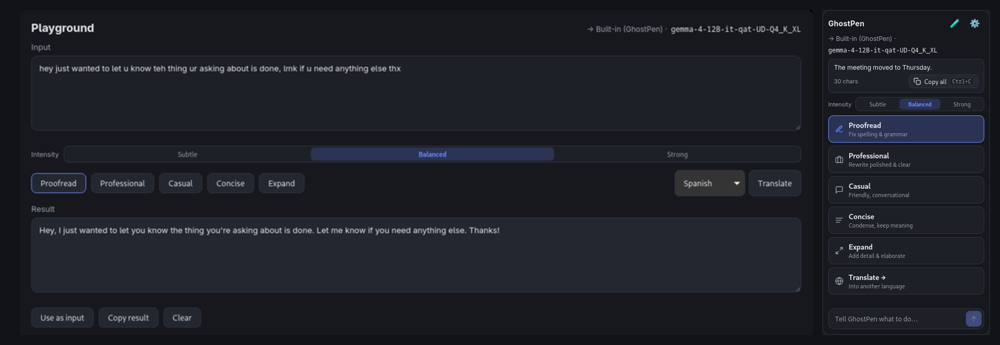

## Examples

Each example is its own Zig package in [`examples/`](../examples), built on Oriel
like any app would be.

### Showcase

**[examples/showcase](../examples/showcase)**: every Oriel feature in one app,
from one codebase, for Linux, Windows, macOS, Android and iOS. Live dictation
(`oriel.dictation`: whisper on the CPU or GPU, or the platform's recognizer),
chat with a local LLM (`oriel.chat`: models, the chat template, streamed
tokens, a reused KV cache), notes in SQLite with deep links
(`oriel-showcase://note/…`), file pickers, the clipboard, notifications,
windows, events and the store; per platform, "dictate anywhere" into other
apps (a system-wide hotkey, the tray and the window menu on the desktop; a
Quick Settings tile, a keyboard and in-app shortcuts on Android) and
background audio on iOS.

  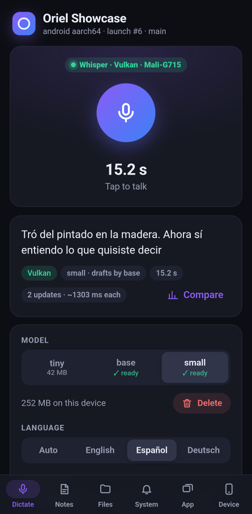
  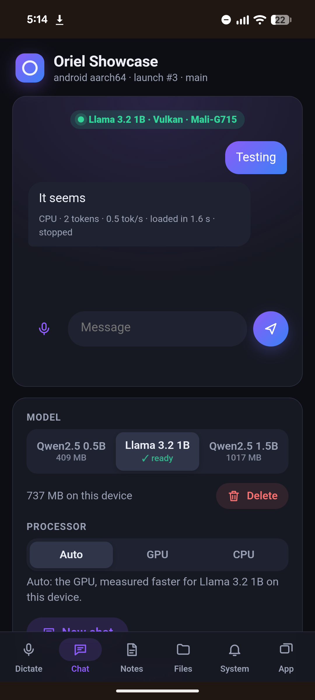
  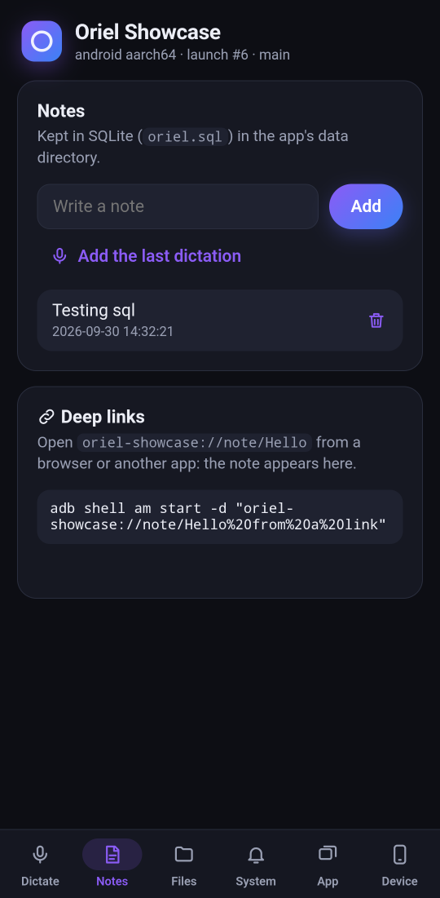
  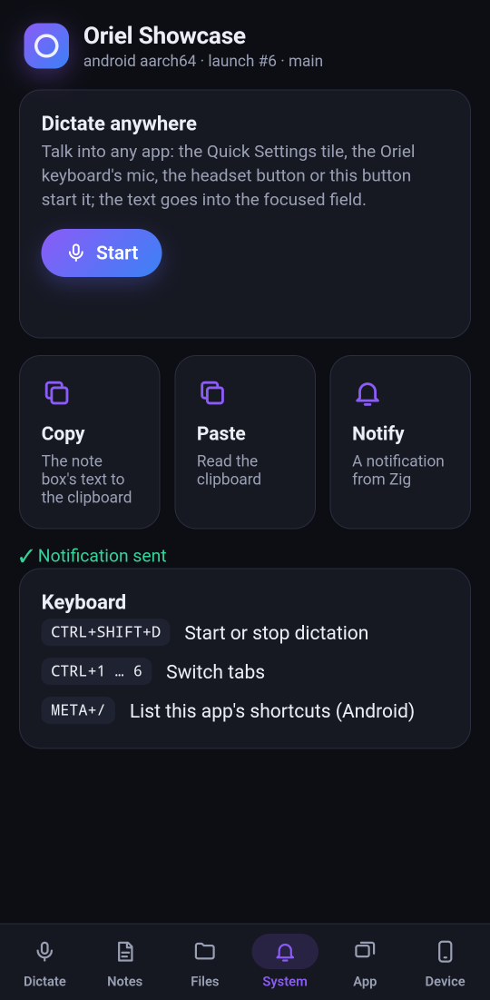
  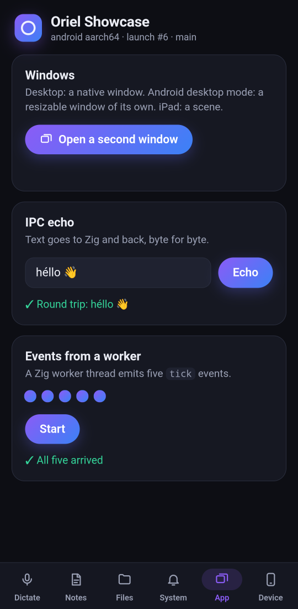

How to build and package it for each platform, with the GPU options:
[examples/showcase/README.md](../examples/showcase/README.md).

### Breakout

**[examples/breakout](../examples/breakout)**: a Breakout game that runs the same
page in the WebView and in the [native renderer](renderers.md#native-renderer-experimental).
The board is a `<canvas>`; the score, overlays and settings are HTML and CSS.
Drag on a phone, mouse or arrow keys on the desktop. Its physics and drawing
run either in JavaScript or in Zig (`BREAKOUT_MODE=zig`, through
`oriel.canvas`), so the same game compares three ways. At 500 balls:

| | Native, Zig | Native, JavaScript | WebView |
|---|---|---|---|
| Windows 11 laptop, 144 Hz | 142–144 fps | 59–75 fps | 103–116 fps |
| Android phone, 120 Hz | 120 fps (0.35 ms of Zig a frame) | 63 fps | 120 fps |

  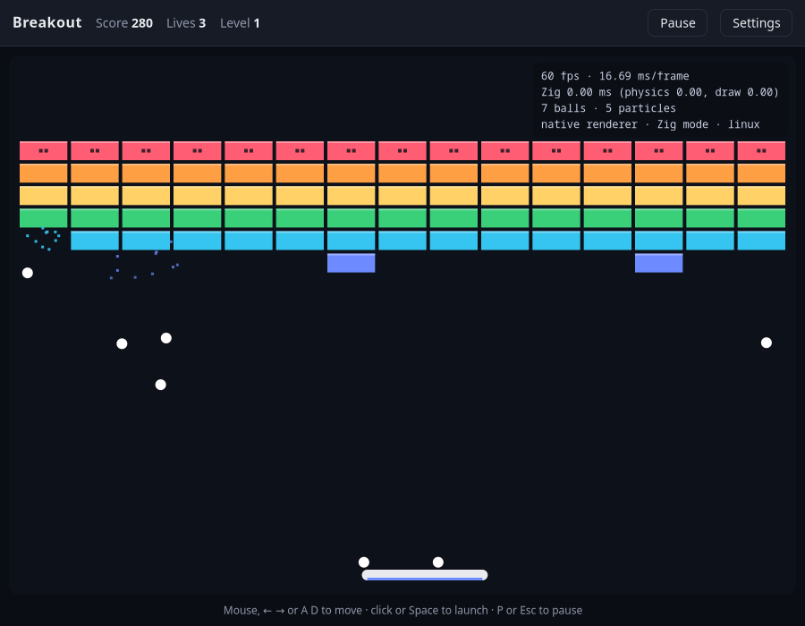
  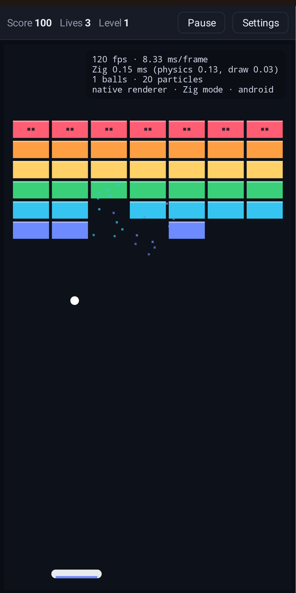

### Smoke test

**[examples/smoke](../examples/smoke)**: every module gets a pass/fail check
inside a real webview — one run tells you Oriel works end to end on your
machine, not just that it compiles. It runs in CI on every platform with each
check listed, so a red one names the module.

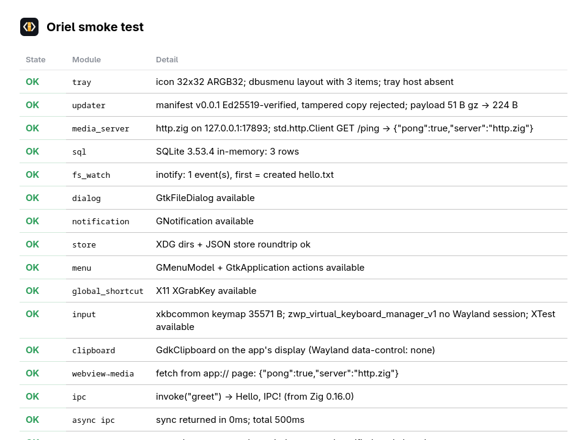

### Render bench

The [render bench](../examples/render-bench) measures row construction and
updates, animation, canvas drawing, startup, and memory in both renderers.
See its [build instructions](../examples/render-bench/README.md) and the
[performance guide](native-renderer-performance.md) for recorded comparisons.

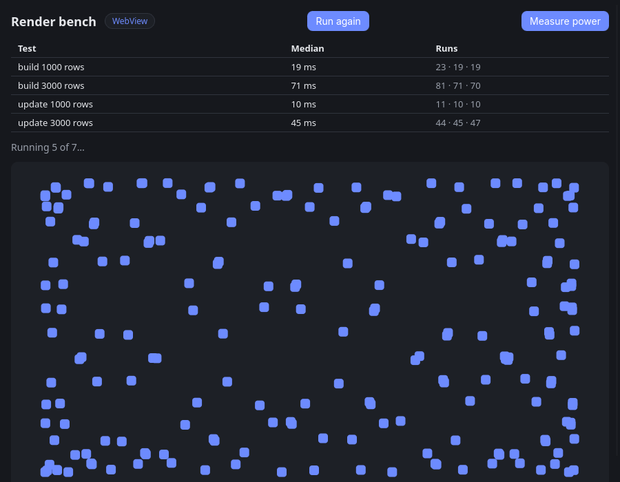

This screenshot shows the WebView UI during a private-display run; use the
performance guide for benchmark figures and measurement conditions.

### Canvas demo

The [canvas demo](../examples/canvas-demo) draws shapes, paths, text,
transforms, and animated balls with the 2D canvas API.

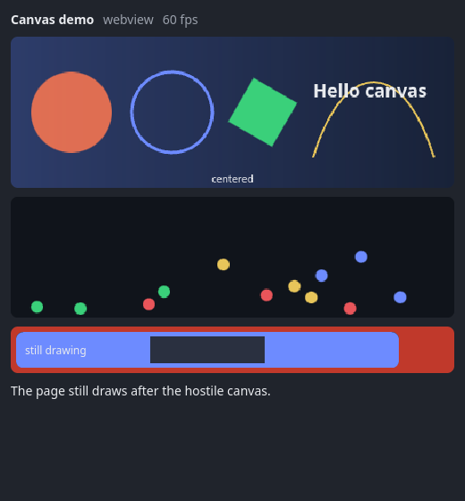
